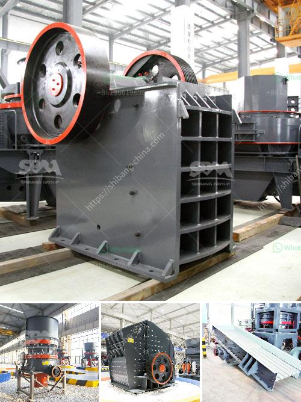

<h3>top ten manufacturers of stone crusher in the world</h3>
Stone crusher is a machinery crushing equipment commonly used in ore and stone production lines. According to its application range, it can be divided into coarse crushing, medium crushing, and fine crushing. The common stone crushers include jaw crusher, cone crusher, impact crusher, mobile crusher, vertical shaft impact crusher, and hammer crusher.

With the ever-increasing variety of manufacturers emerging in the market, it is essential for customers to choose a reliable manufacturer. Here, we introduce the top ten stone crusher manufacturers in the world.

Germany is a leading provider of industrial infrastructure and equipment. The country's worldwide reputation for technological innovation, combined with its highly skilled labor force, provides stone crusher manufacturers with competitive advantages.

The United States has long been one of the world's largest stone crusher markets. Its stone crusher manufacturers have a wealth of experience and advanced technology. The manufacturing process of the stone crusher is strictly controlled to ensure its quality.

Japan has a long history of stone crusher production. The stone crusher manufacturers in Japan are known for their excellent craftsmanship and high-quality products.

China has been the world's largest stone crusher market for decades. Its stone crusher manufacturers have a strong production capacity and high-quality products.

India is a rising economic power with a rapidly growing construction industry. With infrastructure projects being implemented across the country, India's stone crusher manufacturers are witnessing increasing demand for crushers.

Russia ranks among the world's largest stone crusher manufacturers. The country's rich mineral resources have attracted many international stone crusher manufacturers to establish factories in Russia.

Brazil is another country that has vast natural resources and a booming construction industry. Stone crusher manufacturers in Brazil are known for their advanced technology and high-quality products.

South Africa is a well-known stone crusher market in Africa. Its stone crusher manufacturers are renowned for their competitive prices and high-quality products.

Australia has become one of the world's top mining countries and has a strong industrial infrastructure. Its stone crusher manufacturers ensure high-quality products and prompt delivery.

Turkey is emerging as a leading exporter of stone crushers. Its stone crusher manufacturers have a wide range of products and their crushers are highly efficient and energy-saving.

In conclusion, these are the top ten stone crusher manufacturers in the world. With the increasing demand for stone crushers, the competition among manufacturers will become more intense. In order to stay ahead in the market, manufacturers need to improve production technology, reduce production costs, and enhance product quality.
<h3>Contact us</h3><ul><li><strong>Whatsapp:&nbsp;<a href="https://wa.me/8613661969651">+8613661969651</a></strong></li><li><a href="https://swt.shibang-china.com/?git&amp;zhl&amp;top ten manufacturers of stone crusher in the world"><strong>Online Service(chat now)</strong></a></li></ul><h3>Related</h3><ul><li><a href='50tpd cement plant cost in india.md'>50tpd cement plant cost in india</a></li><li><a href='bauxite crushing processing equipments.md'>bauxite crushing processing equipments</a></li><li><a href='crusher in pakistan.md'>crusher in pakistan</a></li><li><a href='jual crusher batubara di indonesia.md'>jual crusher batubara di indonesia</a></li><li><a href='conveyor supplier in the philippines.md'>conveyor supplier in the philippines</a></li></ul>