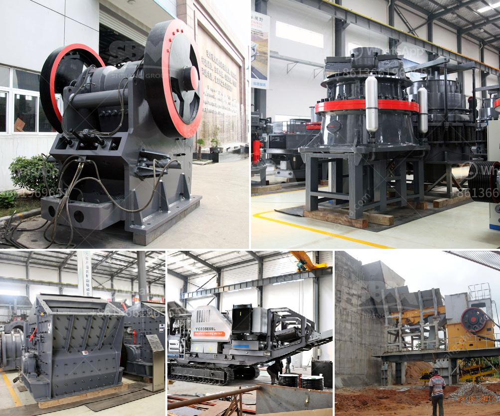

<h3>total cost of stone crushing unit in india</h3>
The stone crushing units can be seen in the vicinity of almost all major cities and towns. Stone crushing units, which are spread almost all over India, fall in the category of these types of establishments, widely known as "crusher plants," are responsible for the breaking down of large stones into smaller pieces of desired sizes. These units are essentially located near construction projects for numerous reasons, such as availability of raw materials, creation of employment opportunities, and easy transportation access.

The stone crushing industry in India represents one of the most potential growth sectors, due to infrastructural development, rapid urbanization, and increasing demand from the construction industry. In recent years, the Indian government has initiated various infrastructure projects, such as the development of ports, roads, and highways, which has boosted the demand for stones and related materials.

The total cost of stone crushing unit in India decides the level of construction activity and, therefore, how much stone required to meet the increasing demand. Stone crushing units need to employ about 50-60 people for various operations such as drilling, loading, hauling, and crushing. Every unit involves the use of machinery, including stone crushers, dozers, loaders, and dumpers.

The total cost of these machinery amounts to about 15-20 million INR for a unit with a production capacity of about 200-250 tons per hour. The machinery used in stone crushing units is modern and efficient. The crushing equipment has proven to be durable and reliable in practice.

Apart from the machinery, the total cost of a stone crushing unit project includes the cost of packaging and labeling. Packaging materials such as plastic bags, jute bags, and cartons are required to package the crushed stones. In some cases, stone crushing units may have to transport the crushed stones over long distances, which further adds to the cost.

The cost of land and rental for the stone crushing unit also adds to the total cost. The land required for setting up a stone crushing unit depends on the size of the unit and its production capacity. If the unit is small or medium-sized, it can be set up on a single plot of land. However, for larger units, the land requirement may vary.

Another significant cost factor for stone crushing units in India is the cost of electricity. The crushers, screens, and conveyors used in the stone crushing process require electricity to operate. The cost of electricity is calculated based on the consumption rate per unit, which varies from state to state in India.

In conclusion, the total cost of a stone crushing unit in India can vary depending on the size and capacity of the unit, the machinery used, packaging materials, transportation costs, and electricity consumption. Given the significant growth opportunities in the construction industry, investing in stone crushing units can be a profitable business venture. With proper planning and execution, stone crushing units can contribute to the nation's infrastructure development while generating employment opportunities.
<h3>Contact us</h3><ul><li><strong>Whatsapp:&nbsp;<a href="https://wa.me/8613661969651">+8613661969651</a></strong></li><li><a href="https://swt.shibang-china.com/?git&amp;zhl&amp;total cost of stone crushing unit in india"><strong>Online Service(chat now)</strong></a></li></ul><h3>Related</h3><ul><li><a href='crushing machine from china.md'>crushing machine from china</a></li><li><a href='ballast crushing machines in nairobi.md'>ballast crushing machines in nairobi</a></li><li><a href='super fine grinding machine in sri lanka.md'>super fine grinding machine in sri lanka</a></li><li><a href='crusher manufacturer in pakistan.md'>crusher manufacturer in pakistan</a></li><li><a href='hammer mill design drawing pdf.md'>hammer mill design drawing pdf</a></li></ul>