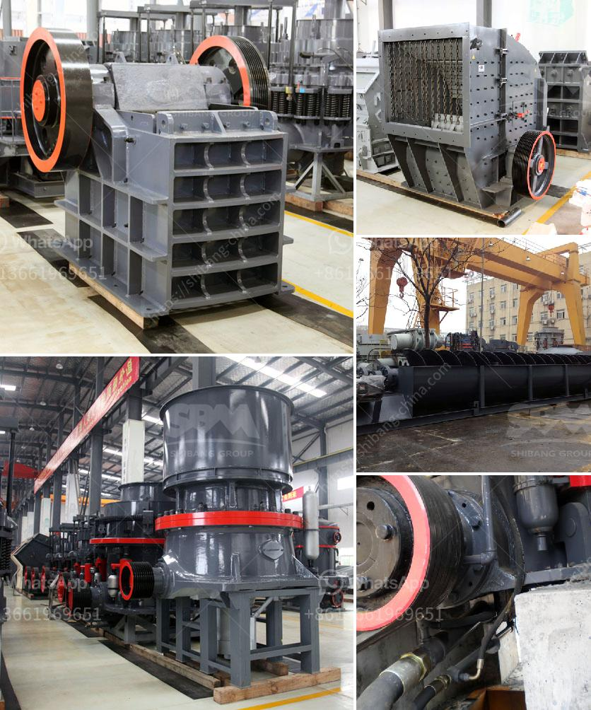

<h3>track mobile crusher</h3>
The track mobile crusher is specifically designed for stone quarrying and recycling industries. This mobile crusher offers efficient operation, versatility, and high productivity for contractors, quarry operators, and others who require reliable performance for their projects. It is designed to crush the toughest rock and ore, and it can be transported easily from one site to another.

One of the key features of the track mobile crusher is its exceptional mobility. This crusher can be easily moved from one site to another using a truck or trailer, allowing it to follow the material processing activity. This flexibility ensures that the crusher can be used in various locations without the need for additional transportation equipment. It offers a cost-effective solution for contractors working on multiple job sites, as they can use a single crusher to process materials at different locations.

The track mobile crusher is equipped with a remote control system, which enables operators to control the entire crushing process from the cab. This feature eliminates the need for additional personnel on the ground, ensuring safe and efficient operation. The remote control system allows operators to adjust the crusher settings, monitor the crusher's performance, and track its location. This ensures that the crusher is running at optimal performance and helps maintain its longevity.

Another significant advantage of the track mobile crusher is its ability to crush a wide range of materials. It can handle materials such as limestone, granite, asphalt, concrete, and more. The crusher's powerful crushing mechanism and wide feed opening ensure high production capabilities, making it suitable for large-scale stone quarrying operations. Additionally, the crusher is equipped with a hydraulic system that allows quick and easy adjustment of the crusher's settings, such as the closed side setting, to ensure precise and consistent product sizing.

In addition to its crushing capabilities, the track mobile crusher also offers exceptional fuel efficiency. It is powered by a diesel engine that meets the latest emissions standards, minimizing environmental impact. The efficient design of the crusher's components, such as the grizzly feeder and the conveyor system, further enhances fuel efficiency by reducing power consumption. This not only helps lower operating costs but also contributes to sustainable and responsible resource management.

In conclusion, the track mobile crusher offers contractors, quarry operators, and recycling industries a reliable and versatile solution for their material processing needs. Its exceptional mobility, remote control system, and ability to crush a wide range of materials make it a valuable asset in various applications. Additionally, its fuel efficiency and environmentally friendly design make it a responsible choice. Whether it is used in stone quarrying or recycling operations, this crusher delivers high productivity, optimum performance, and cost-effective operation.
<h3>Contact us</h3><ul><li><strong>Whatsapp:&nbsp;<a href="https://wa.me/8613661969651">+8613661969651</a></strong></li><li><a href="https://swt.shibang-china.com/?git&amp;zhl&amp;track mobile crusher"><strong>Online Service(chat now)</strong></a></li></ul><h3>Related</h3><ul><li><a href='brick crushers for sale in australia.md'>brick crushers for sale in australia</a></li><li><a href='graphite ore buyers in india.md'>graphite ore buyers in india</a></li><li><a href='stone crushers for sale in kenya.md'>stone crushers for sale in kenya</a></li><li><a href='price list stone crusher german.md'>price list stone crusher german</a></li><li><a href='gypsum board making plant from germany.md'>gypsum board making plant from germany</a></li></ul>