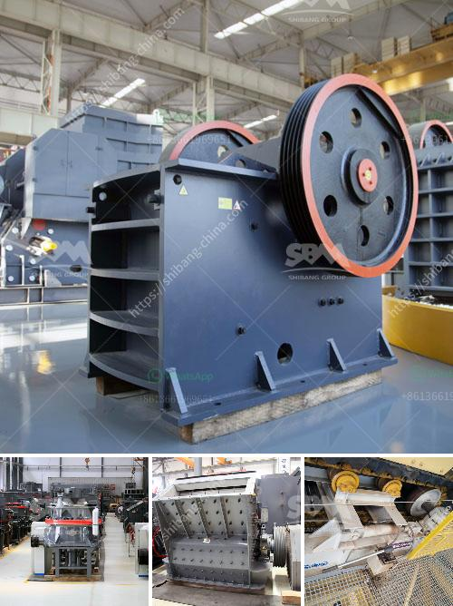

<h3>track mounted crushers</h3>
Track mounted crushers are a mobile crushing solution that offers versatility, durability, and ease of operation. These machines help to reduce material transportation costs while providing quick and efficient crushing capabilities.

The track mounted crushers are known for their compact size and powerful performance. They are ideal for crushing aggregates, construction waste, and recycling materials. Whether it is a road construction project or a demolition site, these crushers can handle various types of materials with ease.

One of the key advantages of track mounted crushers is their mobility. Unlike traditional crushers that require transportation on large trucks or trailers, these crushers can be easily moved from one location to another. This allows contractors to bring the crusher directly to the job site, reducing the time and cost associated with transporting the material to a fixed plant or landfill.

Another benefit of track mounted crushers is their exceptional maneuverability. These crushers can be operated in tight spaces and navigate through narrow job sites with ease. This makes them the preferred choice for urban construction projects where space is limited.

Track mounted crushers also offer superior crushing capabilities. Equipped with powerful engines and heavy-duty components, these machines can break down even the toughest materials. They are designed to handle large rocks, concrete, and asphalt, making them suitable for a wide range of applications.

Furthermore, track mounted crushers are easy to operate. They come with user-friendly controls and display panels that provide comprehensive information about the machine's performance and maintenance requirements. This makes it easy for operators to monitor and adjust the crusher settings to achieve the desired output.

Overall, track mounted crushers are a reliable and efficient solution for mobile crushing. Whether it is a small residential project or a large-scale construction site, these machines offer the versatility, durability, and performance required to get the job done efficiently. Contractors and construction companies can greatly benefit from investing in track mounted crushers to streamline their operations and boost productivity.
<h3>Contact us</h3><ul><li><strong>Whatsapp:&nbsp;<a href="https://wa.me/8613661969651">+8613661969651</a></strong></li><li><a href="https://swt.shibang-china.com/?git&amp;zhl&amp;track mounted crushers"><strong>Online Service(chat now)</strong></a></li></ul><h3>Related</h3><ul><li><a href='gold hammer mill used for sale in zimbabwe.md'>gold hammer mill used for sale in zimbabwe</a></li><li><a href='large capacity jaw crusher machines sales to india.md'>large capacity jaw crusher machines sales to india</a></li><li><a href='used crushing plant for sale.md'>used crushing plant for sale</a></li><li><a href='pebble stone crusher.md'>pebble stone crusher</a></li><li><a href='roller mill spaider.md'>roller mill spaider</a></li></ul>