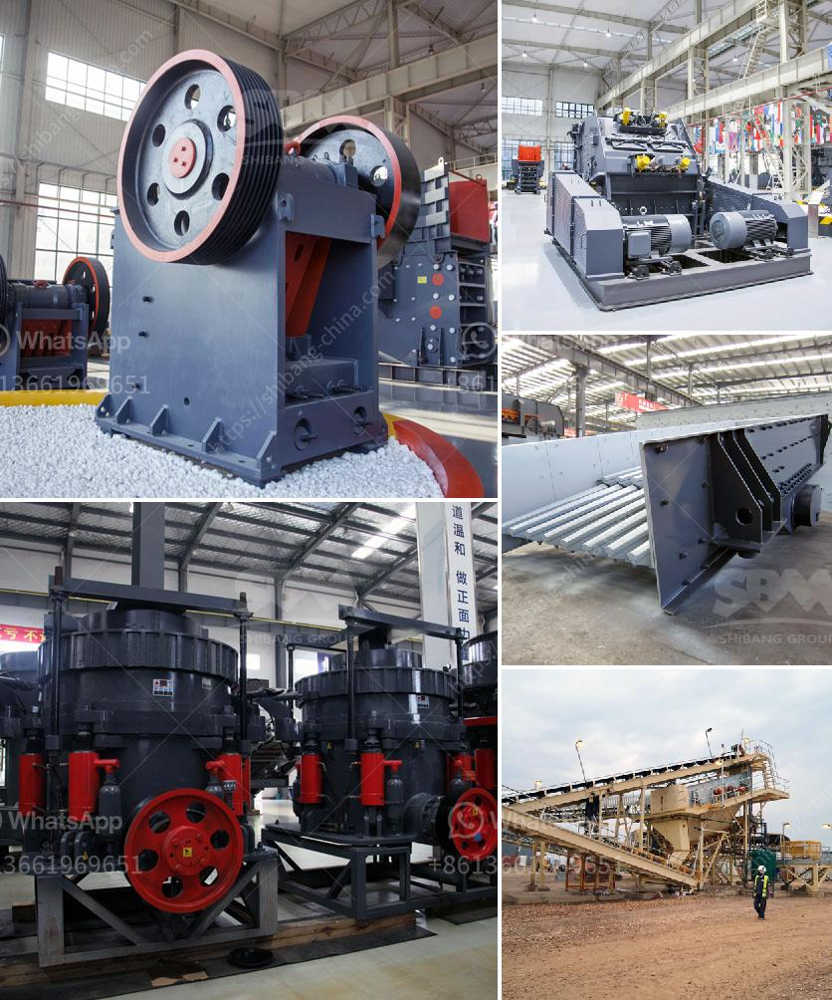

<h3>traditional crushing machine</h3>
The traditional crushing machine, also known as the jaw crusher or the toggle crusher, is a robust and reliable machine widely utilized in the mining industry. It is designed to crush solid materials, such as rocks or ores, into smaller pieces for further processing and utilization.

The traditional crushing machine consists of two vertical jaws, one fixed and the other movable. The fixed jaw is typically positioned slightly inclined towards the top of the crusher, while the movable jaw is attached to an eccentric shaft that rotates the jaw plate up and down. As the materials are fed into the crusher chamber through the top opening, they are gradually crushed between the two jaws.

One of the main advantages of the traditional crushing machine is its simplicity and ease of use. With a straightforward design and minimal moving parts, the machine is relatively easy to operate and maintain. This makes it an appealing option for mines and quarries where trained personnel may not always be available.

Another significant advantage of the traditional crushing machine is its high capacity and efficiency. The powerful crushing action provided by the jaw plates allows for the quick reduction of large quantities of material. Consequently, the machine can handle a wide range of materials with varying hardness and size, offering versatility in its applications.

Furthermore, the traditional crushing machine can produce a uniform product size with a well-defined shape. This is crucial in various industries, such as construction and road building, where consistent and standardized materials are required. The machine's ability to control the size and shape of the crushed materials contributes to its widespread use.

While the traditional crushing machine offers numerous benefits, it also has certain limitations. For instance, it is not suitable for crushing extremely hard or abrasive materials, which may cause excessive wear on the jaw plates. Additionally, the machine may generate significant noise and vibrations during operation, requiring appropriate noise and vibration dampening measures.

Overall, the traditional crushing machine remains a popular choice in the mining industry due to its robustness, efficiency, and ease of use. With ongoing advancements in technology, modern variations of this machine have been developed, incorporating enhanced features and capabilities. However, the traditional version remains a reliable workhorse in many mines and quarries, contributing to the extraction and processing of valuable minerals and materials.
<h3>Contact us</h3><ul><li><strong>Whatsapp:&nbsp;<a href="https://wa.me/8613661969651">+8613661969651</a></strong></li><li><a href="https://swt.shibang-china.com/?git&amp;zhl&amp;traditional crushing machine"><strong>Online Service(chat now)</strong></a></li></ul><h3>Related</h3><ul><li><a href='maintenance plan of crusher.md'>maintenance plan of crusher</a></li><li><a href='stone crushing machines in italy.md'>stone crushing machines in italy</a></li><li><a href='material used in vertical mill.md'>material used in vertical mill</a></li><li><a href='the estimated cost of setting up a quarry.md'>the estimated cost of setting up a quarry</a></li><li><a href='suppliers of crush or rocks pretoria.md'>suppliers of crush or rocks pretoria</a></li></ul>