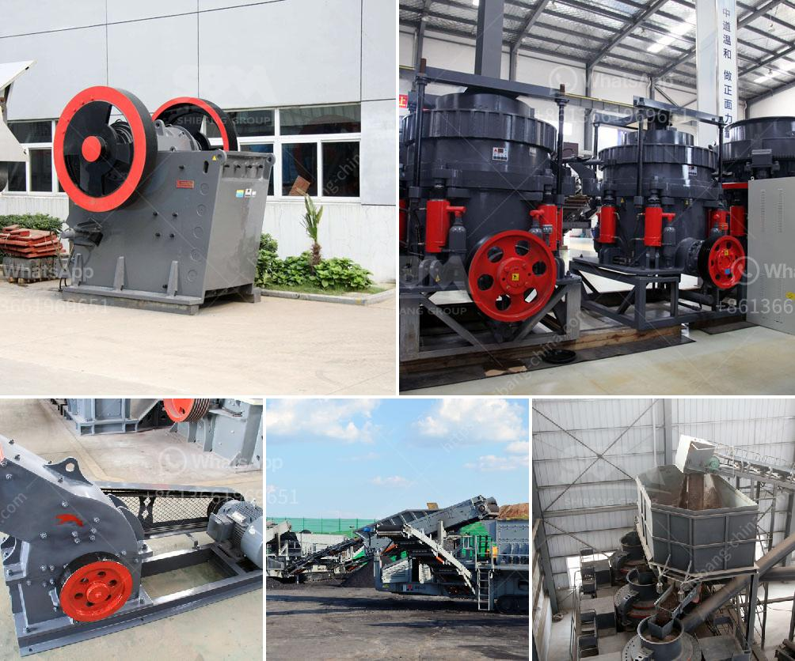

<h3>turkey cement mill plant for sale</h3>
As Turkey's economy continues to expand, the country's cement industry has been growing at an impressive rate. The demand for cement in Turkey has reached an all-time high, sparking a flurry of new cement mill plant projects across the country. With several government-led initiatives aimed at boosting infrastructure development, the need for cement is expected to remain strong in the coming years. For investors looking to capitalize on this booming sector, a cement mill plant for sale in Turkey may offer a lucrative opportunity.

Turkey's cement industry has a long-standing history, with the first cement factory established in 1911. Today, Turkey is the 4th largest producer of cement worldwide and accounts for 6% of global cement production. The country's cement sector operates over 56 integrated plants and has a total annual production capacity of over 100 million tons.

One of the key players in Turkey's cement market is Limak Holding, a prominent industrial conglomerate with diverse interests. Limak Holding owns and operates several cement plants in Turkey, employing state-of-the-art technology to ensure high-quality cement production. The company has cement plants strategically located across the country, allowing it to effectively meet the growing demand for cement in different regions. One of their cement mill plants is now available for sale.

Located in the Aegean region of Turkey, this cement mill plant has a production capacity of 3 million tons per year. With a land area of 1,880,000 square meters and a construction area of 65,000 square meters, the facility includes 4 cement silos, 1 clinker storage area, 1 cement grinding mill, 1 cement packing plant, and other necessary infrastructure.

The cement mill plant has been designed and built to meet environmental regulations, ensuring sustainable and eco-friendly operation. It is equipped with the latest technology to maximize energy efficiency and reduce emissions. This not only helps mitigate the impact on the environment but also improves cost-effectiveness and enhances the plant's competitiveness.

Investing in a cement mill plant in Turkey offers several advantages. Firstly, Turkey's strategic location between Europe, Asia, and Africa provides easy access to a wide range of markets, making it an ideal export hub. Additionally, Turkey's favorable investment environment, competitive labor costs, and government incentives attract foreign investors.

Furthermore, the Turkish government's commitment to infrastructure development presents significant opportunities for cement producers. Several mega-projects, including the construction of new airports, highways, and metro lines, are in progress or planned across the country. These projects require a substantial amount of cement, creating a robust demand for cement mill plants.

In conclusion, the cement industry in Turkey is thriving, driven by strong domestic demand and government-led infrastructure projects. A cement mill plant for sale in Turkey presents a promising investment opportunity for both local and foreign investors. The plant's modern design, high-quality equipment, economic feasibility, and strategic location provide excellent conditions for profitable cement production. As Turkey's cement industry looks set to continue its growth trajectory, investing in a cement mill plant is an opportunity that should not be missed.
<h3>Contact us</h3><ul><li><strong>Whatsapp:&nbsp;<a href="https://wa.me/8613661969651">+8613661969651</a></strong></li><li><a href="https://swt.shibang-china.com/?git&amp;zhl&amp;turkey cement mill plant for sale"><strong>Online Service(chat now)</strong></a></li></ul><h3>Related</h3><ul><li><a href='mobile tracked crushers.md'>mobile tracked crushers</a></li><li><a href='mobile diamond washing plant for sale.md'>mobile diamond washing plant for sale</a></li><li><a href='barite processing plant feasibility study.md'>barite processing plant feasibility study</a></li><li><a href='output size of stone crusher machine.md'>output size of stone crusher machine</a></li><li><a href='jual stone crusher plant kredit.md'>jual stone crusher plant kredit</a></li></ul>