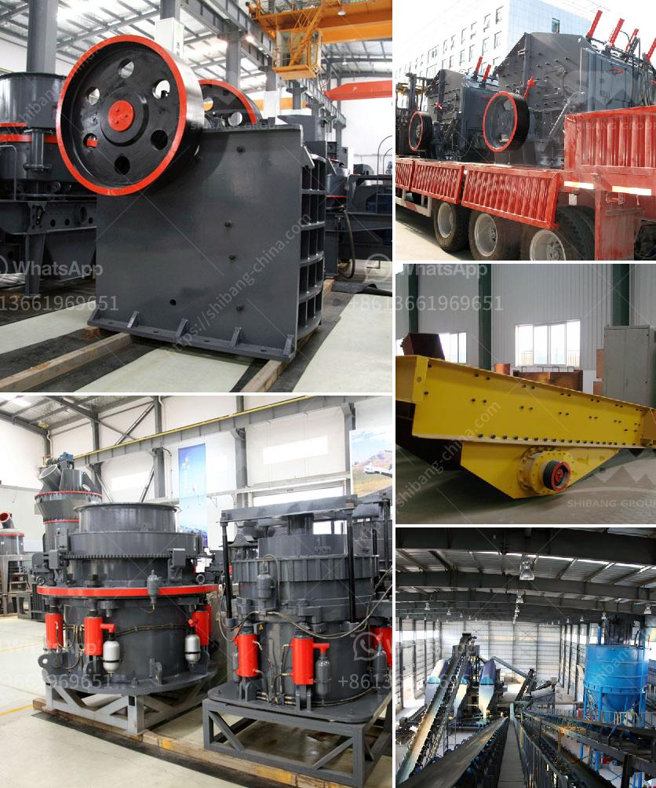

<h3>turkey cone crusher kenya</h3>
Turkey is located in the Mediterranean region and connects Europe with Asia. With its rich history and unique geographical location, Turkey has become a hub for trade and commerce. One of the key industries in Turkey is the mining industry. Kenya, on the other hand, is an African country with vast natural resources and a growing economy. In recent years, the demand for cone crushers in Kenya has been on a steady rise, owing to the increased need for secondary and tertiary crushing.

Cone crushers are highly efficient crushing machines suitable for crushing various types of hard and abrasive materials. They are commonly used in the mining and construction industries due to their high productivity and low operating costs. Turkey, known for its advanced technology and manufacturing capabilities, offers a wide range of cone crushers to meet the crushing needs of Kenya.

One such Turkish company that has gained popularity in Kenya is GURSAN. GURSAN has been producing high-quality cone crushers since 1979 and has gained a worldwide reputation for their durability and performance. They offer a variety of cone crushers, including the GCS series and GHP series, which are designed to crush different types of materials with varying hardness levels.

The GCS series cone crushers are known for their high capacity and excellent product quality. They are suitable for hard and abrasive materials, such as granite, basalt, and quartz. The GCS series cone crushers feature a robust design and a hydraulic system that ensures easy and efficient operation.

The GHP series cone crushers, on the other hand, are designed for tertiary and quaternary crushing applications. They can crush a wide range of materials, including limestone, dolomite, and river gravel. The GHP series cone crushers are equipped with a hydraulic system and a multi-cylinder design, which ensures high performance and reliability.

In conclusion, Turkey cone crushers are an ideal choice for crushing hard materials in Kenya. With their advanced technology and manufacturing capabilities, Turkish companies like GURSAN offer a range of cone crushers that are durable, efficient, and cost-effective. These cone crushers can meet the growing demand for secondary and tertiary crushing in Kenya's mining and construction industries.
<h3>Contact us</h3><ul><li><strong>Whatsapp:&nbsp;<a href="https://wa.me/8613661969651">+8613661969651</a></strong></li><li><a href="https://swt.shibang-china.com/?git&amp;zhl&amp;turkey cone crusher kenya"><strong>Online Service(chat now)</strong></a></li></ul><h3>Related</h3><ul><li><a href='coal crusher machine capacity of 5 tons an hour.md'>coal crusher machine capacity of 5 tons an hour</a></li><li><a href='50 tpd iron crusher machinery cost.md'>50 tpd iron crusher machinery cost</a></li><li><a href='stone crusher machinery suppliers.md'>stone crusher machinery suppliers</a></li><li><a href='ethiopia conveyor belt india.md'>ethiopia conveyor belt india</a></li><li><a href='ballast crusher plant.md'>ballast crusher plant</a></li></ul>