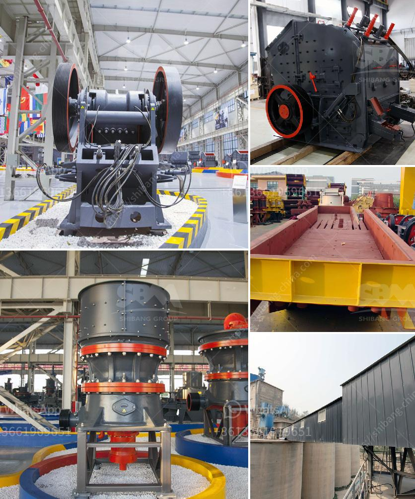

<h3>turkey gold processing plants</h3>
Turkey, with its rich history and geographical advantages, has become a hotspot for gold mining in recent years. Along with mining activities, the country has also witnessed a surge in gold processing plants. These plants play a crucial role in extracting gold from ore and preparing it for various end uses.

One of the key reasons for the increasing number of gold processing plants in Turkey is the abundance of gold reserves. With an estimated 5,500 tons of gold reserves, the country holds a significant position globally. This has attracted both local and international mining companies to establish processing plants within Turkish borders.

These gold processing plants range in size, accommodating various production capacities. However, plants with a capacity of 100-300 tons per day are gaining popularity due to their cost-effective operations and flexibility. These plants are equipped with advanced machinery and technology, ensuring efficient extraction of gold and minimal wastage.

Moreover, these processing plants contribute to the local economy by creating job opportunities and promoting economic growth in the regions where they are established. The mining industry, including gold processing plants, has become a major source of employment for Turkish citizens. The sector provides job security and attractive remuneration, attracting skilled professionals and boosting the overall standard of living in these regions.

Additionally, the gold extracted from these processing plants serves various purposes. A significant portion of the gold is used for jewelry production, meeting the demand of both domestic and international markets. The remaining gold is sold to investors and central banks, contributing to the country's foreign exchange reserves.

However, establishing and operating gold processing plants require adhering to governmental regulations and environmental sustainability practices. The Turkish government has put in place strict guidelines to ensure responsible mining and mitigate environmental impacts. These regulations maintain a balance between economic growth and environmental protection, reflecting the country's commitment to sustainable development.

In conclusion, Turkey's gold processing plants have experienced a remarkable growth in recent years, thanks to the abundance of gold reserves and governmental support. These plants not only boost the local economy but also provide job opportunities to numerous individuals. With the increasing demand for gold, the industry is likely to expand further, establishing Turkey as a major player in the global gold market.
<h3>Contact us</h3><ul><li><strong>Whatsapp:&nbsp;<a href="https://wa.me/8613661969651">+8613661969651</a></strong></li><li><a href="https://swt.shibang-china.com/?git&amp;zhl&amp;turkey gold processing plants"><strong>Online Service(chat now)</strong></a></li></ul><h3>Related</h3><ul><li><a href='second hand raymond mill in india.md'>second hand raymond mill in india</a></li><li><a href='quarry equipment and crushers companies in japan.md'>quarry equipment and crushers companies in japan</a></li><li><a href='stone quarries south africa.md'>stone quarries south africa</a></li><li><a href='700t h mobile crusher.md'>700t h mobile crusher</a></li><li><a href='high speed hand powder crushing machine.md'>high speed hand powder crushing machine</a></li></ul>