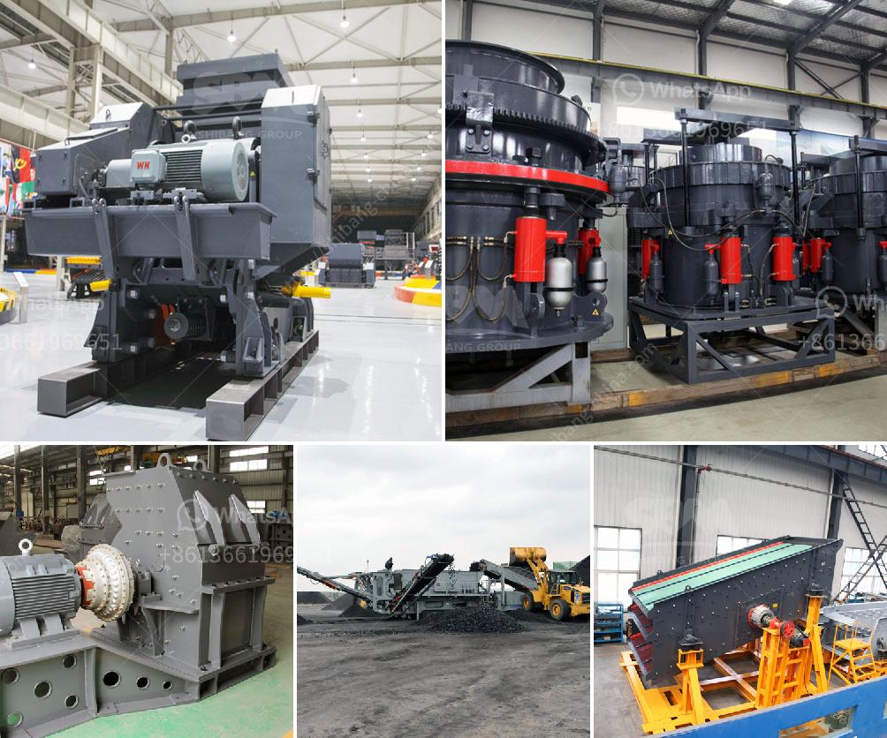

<h3>turkish association marble machinery</h3>
Turkey has always been a prominent player in the international stone industry, known for its vast marble reserves and rich cultural heritage in stone carving. With the rise in demand for natural stones globally, the Turkish Association of Marble Machinery (TAMM) has emerged as a key organization driving the growth and innovation in this sector.

Established in 2012, TAMM has been instrumental in promoting the Turkish stone industry's technological capabilities and facilitating collaboration between manufacturers, exporters, and customers. The association aims to elevate the production and export standards, encourage research and development activities, and foster an environment of cooperation among industry stakeholders.

One of the primary initiatives of TAMM is enhancing the technological infrastructure of the marble industry. The association has played a pivotal role in introducing cutting-edge machinery and equipment to Turkish manufacturers, ensuring their competitiveness in the global market. TAMM organizes regular exhibitions and showcases where manufacturers can explore the latest advancements in stone machinery, ranging from cutting and polishing machines to CNC routers and bridge saws.

Moreover, TAMM acts as a bridge between Turkish stone machinery manufacturers and international buyers. The association actively participates in international trade fairs, connecting domestic suppliers with potential customers from around the world. By representing its members on a global platform, TAMM has significantly contributed to increasing the visibility and market reach of Turkish marble machinery.

TAMM also places great emphasis on research and development within the marble sector. Through collaboration with universities, research institutions, and industry experts, the association strives to enhance the manufacturing processes and product quality. It promotes innovation and the adaptation of advanced technologies, enabling Turkish manufacturers to produce marble products of superior quality.

Another crucial aspect of TAMM's work is promoting sustainability and eco-friendly practices within the stone industry. Aware of the environmental impact of quarrying and processing natural stones, TAMM encourages its members to adopt sustainable practices. This includes implementing energy-efficient machinery, reducing water consumption, and adopting better waste management techniques. By incorporating sustainable measures, TAMM aims to position Turkish marble as an environmentally friendly choice in the global market.

In addition to its industry-related initiatives, TAMM also offers various forms of support to its members. This includes providing legal advice, offering marketing and promotional assistance, and organizing training programs to enhance the skills and knowledge of industry professionals. With its comprehensive range of services, the association aims to nurture growth and development across the entire value chain of the marble industry.

Driven by TAMM's efforts, the Turkish stone machinery sector has witnessed remarkable growth and has become a global force to be reckoned with. Today, Turkey stands as one of the leading exporters of marble and stone-related products, thanks in large part to the modernized production facilities and advanced machinery adopted by its manufacturers.

In conclusion, the Turkish Association of Marble Machinery has played a pivotal role in revolutionizing the stone industry in Turkey. Through its focus on technological advancement, research and development, sustainability, and international collaboration, TAMM has propelled the Turkish marble sector to new heights. With its unwavering commitment to quality and innovation, the association ensures that Turkey remains at the forefront of the global stone industry.
<h3>Contact us</h3><ul><li><strong>Whatsapp:&nbsp;<a href="https://wa.me/8613661969651">+8613661969651</a></strong></li><li><a href="https://swt.shibang-china.com/?git&amp;zhl&amp;turkish association marble machinery"><strong>Online Service(chat now)</strong></a></li></ul><h3>Related</h3><ul><li><a href='kenya stone crusher usa.md'>kenya stone crusher usa</a></li><li><a href='gypsum beneficiation process.md'>gypsum beneficiation process</a></li><li><a href='chrome crushing plant.md'>chrome crushing plant</a></li><li><a href='quartz crusher manufacturing process.md'>quartz crusher manufacturing process</a></li><li><a href='pine cone coal manufacturing machinery.md'>pine cone coal manufacturing machinery</a></li></ul>