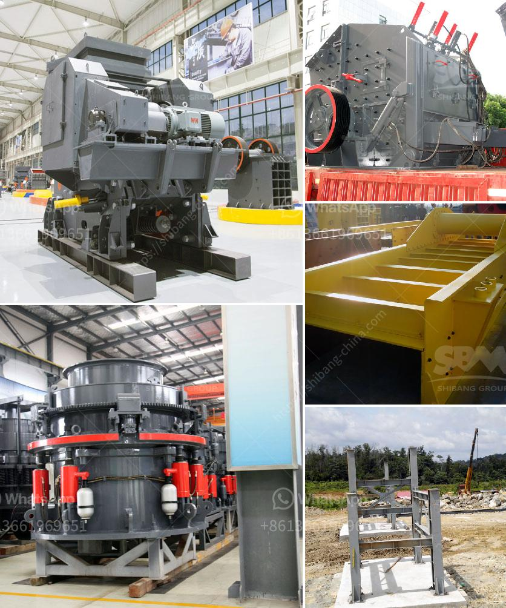

<h3>turkish supplier for phosphate ball mill</h3>
Phosphate ball mills play a vital role in the phosphate fertilizer industry. Since its invention, the ball mill technology has been used worldwide. Phosphate rock is a crucial material for fundamental chemical and agricultural industries. With a growing global demand for phosphate-based fertilizers, producers are in constant search for reliable suppliers to meet this demand. Turkey has emerged as a leading supplier for phosphate ball mills, providing efficient equipment that meets international quality standards.

Turkish suppliers have gained recognition for their commitment to quality manufacturing and engineering expertise. With a focus on enhancing operational efficiency, Turkish companies have honed their manufacturing techniques to deliver supreme quality phosphate ball mills. These suppliers invest in cutting-edge technology, ensuring their machinery meets international standards and provides maximum efficiency in phosphate processing.

Moreover, Turkish suppliers are known for their ability to customize ball mills, taking into account specific requirements of clients. This flexibility allows them to meet diverse customer needs, enhancing their competitiveness in the global market.

Cost-effectiveness is a crucial factor for any industry, especially in the fertilizer sector. Turkish suppliers are well aware of this and aim to provide cost-effective solutions for phosphate ball mills. By streamlining production processes, optimizing resources, and utilizing innovative technology, Turkish suppliers offer competitively priced ball mills without compromising on quality.

The favorable exchange rates and competitive labor costs in Turkey are additional advantages that contribute to the affordability of phosphate ball mills manufactured by Turkish suppliers. These factors make Turkey an attractive destination for global companies seeking cost-effective phosphate processing solutions.

To solidify their position in the international market, Turkish suppliers follow strict quality control measures throughout the manufacturing process. These measures ensure that phosphate ball mills meet the highest standards in terms of performance, reliability, and durability. Quality assurance certificates from globally recognized organizations validate the reliability of Turkish suppliers, fostering trust among customers worldwide.

Furthermore, Turkish suppliers provide excellent after-sales support as part of their commitment to customer satisfaction. Prompt response times, technical assistance, and spare part availability are some of the key features of their comprehensive after-sales support. This ensures uninterrupted operation of phosphate ball mills, minimizing downtime and maximizing productivity.

The phosphate ball mill industry plays a pivotal role in the global fertilizer market. Turkish suppliers have demonstrated their capabilities in manufacturing high-quality and cost-effective ball mills to meet the increasing global demand. Their engineering expertise, dedication to quality manufacturing, and commitment to customer satisfaction have made them trusted partners for companies worldwide.

With Turkey's advantageous exchange rates and competitive labor costs, Turkish suppliers have become a go-to destination for businesses seeking reliable and affordable phosphate ball mills. As the demand for phosphate-based fertilizers continues to rise, Turkish suppliers are poised to contribute to the growth and success of the global fertilizer market.
<h3>Contact us</h3><ul><li><strong>Whatsapp:&nbsp;<a href="https://wa.me/8613661969651">+8613661969651</a></strong></li><li><a href="https://swt.shibang-china.com/?git&amp;zhl&amp;turkish supplier for phosphate ball mill"><strong>Online Service(chat now)</strong></a></li></ul><h3>Related</h3><ul><li><a href='german made jaw crusher prices.md'>german made jaw crusher prices</a></li><li><a href='dolomite processing equipment.md'>dolomite processing equipment</a></li><li><a href='jaw crusher part diagram.md'>jaw crusher part diagram</a></li><li><a href='salt crusher machine pakistan.md'>salt crusher machine pakistan</a></li><li><a href='crusher manufacturer in saudi.md'>crusher manufacturer in saudi</a></li></ul>