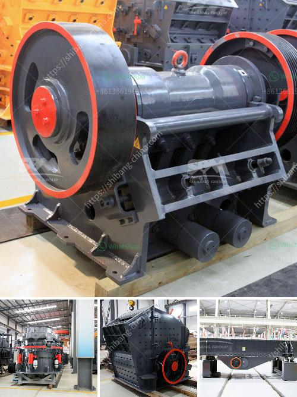

<h3>types of belt conveyors used in cement industries</h3>
Belt conveyors are commonly used in the cement industry to transport materials over short distances. They are a cost-effective and efficient way to move bulk materials such as limestone, gravel, or crushed cement. Different types of belt conveyors are available, each with its own specific purpose and advantages.

One of the most common types of belt conveyors used in the cement industry is the slider bed conveyor. This type of conveyor consists of a wide belt made of rubber, fabric, or PVC that is supported by a bed of rollers or a flat metal surface. The slider bed conveyor is ideal for conveying light to medium-weight materials such as aggregates, sand, or cement.

Another type of belt conveyor used in the cement industry is the troughed belt conveyor. This conveyor features a troughed belt that offers increased capacity over the slider bed conveyor. The troughed design helps prevent spillage of materials and allows for steeper inclines or declines. Troughed belt conveyors are commonly used for transporting bulk materials over long distances in a cement plant.

In addition to these main types, there are also specialized belt conveyors used in cement industries. For example, bucket elevators are commonly used to vertically transport bulk materials such as limestone or cement clinker. These elevators use buckets attached to a belt or chain to lift the materials vertically.

Overall, belt conveyors are a crucial part of cement plants as they help in the efficient movement of materials. Choosing the right type of belt conveyor depends on factors such as the type of material being transported, the distance it needs to travel, and the required capacity. By using the appropriate type of belt conveyor, cement industries can ensure smooth operations and maximize productivity.
<h3>Contact us</h3><ul><li><strong>Whatsapp:&nbsp;<a href="https://wa.me/8613661969651">+8613661969651</a></strong></li><li><a href="https://swt.shibang-china.com/?git&amp;zhl&amp;types of belt conveyors used in cement industries"><strong>Online Service(chat now)</strong></a></li></ul><h3>Related</h3><ul><li><a href='jaw crusher in uzbekistan.md'>jaw crusher in uzbekistan</a></li><li><a href='companies of roller mills.md'>companies of roller mills</a></li><li><a href='gypsum powder uses in construction.md'>gypsum powder uses in construction</a></li><li><a href='construction construction belt.md'>construction construction belt</a></li><li><a href='to 200 tph pe 750 1060 copper ore jaw crusher.md'>to 200 tph pe 750 1060 copper ore jaw crusher</a></li></ul>