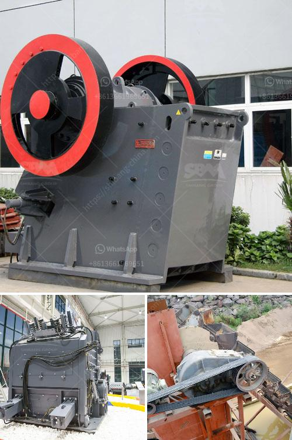

<h3>types of diesel hammer mills in zimbabwe</h3>
Zimbabwe is a country known for various agricultural activities and the availability of affordable machinery to enhance these activities is very important. One essential machinery for any agricultural project is a hammer mill. These mills are used to grind and crush materials into small particles. In Zimbabwe, the availability of diesel-powered hammer mills to enhance agricultural productivity and efficiency is a crucial factor.

There are several types of diesel hammer mills available in Zimbabwe today. The grinding mills type of diesel-powered hammer mill is a combination of small horsepower and large horsepower. These hammer mills are used to crush and grind different types of raw materials, such as maize, sorghum, beans, cassava, and other agricultural products. The grinding mills allow farmers to mill and grind their produce to the desired consistency without much effort.

One type of diesel hammer mill that is widely used in Zimbabwe is the small-scale diesel hammer mill. The power of this hammer mill is usually around 2 to 3 HP, which makes it suitable for small-scale farmers. These types of mills are widely used for grinding maize, cobs, and stalks, as well as other agricultural products. They are portable, easy to operate, and can be used on-site without the need for electricity.

Another type of diesel hammer mill is the medium-scale diesel hammer mill. This hammer mill usually has a power output ranging from 5 to 10 HP and is suitable for medium-scale farmers or agricultural cooperatives. It can grind a variety of crops, including maize, sorghum, and other grains. Its portability and versatility make it an excellent choice for farmers who need to process a larger quantity of grain.

The high-capacity diesel hammer mill is another type commonly found in Zimbabwe. This hammer mill is powered by a diesel engine with a power output of 15 to 30 HP, making it suitable for large-scale farmers and commercial use. It can handle larger volumes of grain and is capable of grinding a wide range of agricultural products. The high-capacity diesel hammer mills are often used in large-scale maize and grain processing industries.

In conclusion, diesel-powered hammer mills are essential machinery for improving agricultural productivity in Zimbabwe. The availability of different types and sizes of diesel hammer mills ensures that farmers and agricultural enterprises can find the appropriate mill for their needs. Whether it is a small-scale, medium-scale, or high-capacity hammer mill, farmers can benefit from the convenience, portability, and efficiency of these machines. With the right hammer mill, farmers can process their agricultural products efficiently and effectively, ultimately contributing to increased productivity and improved livelihoods in Zimbabwe's agricultural sector.
<h3>Contact us</h3><ul><li><strong>Whatsapp:&nbsp;<a href="https://wa.me/8613661969651">+8613661969651</a></strong></li><li><a href="https://swt.shibang-china.com/?git&amp;zhl&amp;types of diesel hammer mills in zimbabwe"><strong>Online Service(chat now)</strong></a></li></ul><h3>Related</h3><ul><li><a href='jaw crushers tungsten carbide powder.md'>jaw crushers tungsten carbide powder</a></li><li><a href='mobile coal washing plant.md'>mobile coal washing plant</a></li><li><a href='used stone crusher mashines usa.md'>used stone crusher mashines usa</a></li><li><a href='hydraulic stone crusher for hire uk.md'>hydraulic stone crusher for hire uk</a></li><li><a href='stone quarrying companies in tanzania.md'>stone quarrying companies in tanzania</a></li></ul>