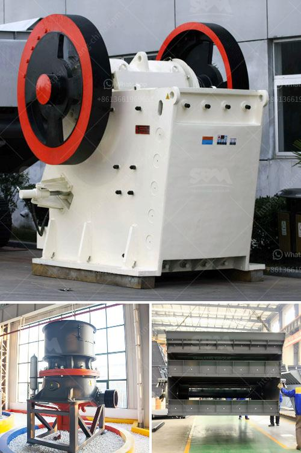

<h3>types of stone crusher with different output size</h3>
Stone crusher is a crushing equipment designed to break large stones into small pieces. Depending on the type of crusher used, different output size is achieved. The following are the commonly used stone crushers with different output size:

Jaw crusher: It is a primary crushing equipment with a processing capacity of 1-2200t/h. Jaw crusher has a simple structure, reliable operation, and low operating costs. The discharge size of jaw crusher can be adjusted to meet the requirements of different users.

Impact crusher: This type of crusher has a high crushing ratio and a uniform particle size. It is commonly used in metallurgical, construction, and chemical industries. The discharging particle size can be adjusted between 0-400mm.

Cone crusher: Cone crusher has the advantages of high crushing ratio, low energy consumption, and uniform product size. It is suitable for medium and fine crushing of various ores and rocks. The discharge size can be adjusted to meet different customer requirements.

Hammer crusher: It is mainly used for crushing medium-hardness and brittle materials, such as limestone, coal, and other materials. The output size can be adjusted according to different needs.

Roller crusher: This crusher is composed of two rotating rollers, and it has the advantages of high efficiency, low energy consumption, and uniform particle size. The discharge size can be adjusted between 10-300mm.

In conclusion, the stone crusher with different output size is suitable for various crushing operations. Choosing the right crusher is important to achieve the desired product size and shape. Consider the properties of raw materials, such as hardness and humidity, as well as the required output size when selecting a crusher. It is advisable to consult with professionals to ensure the appropriate crusher is chosen for your specific needs.
<h3>Contact us</h3><ul><li><strong>Whatsapp:&nbsp;<a href="https://wa.me/8613661969651">+8613661969651</a></strong></li><li><a href="https://swt.shibang-china.com/?git&amp;zhl&amp;types of stone crusher with different output size"><strong>Online Service(chat now)</strong></a></li></ul><h3>Related</h3><ul><li><a href='hammer mill price in nigeria.md'>hammer mill price in nigeria</a></li><li><a href='mining machinery companies in germany.md'>mining machinery companies in germany</a></li><li><a href='copper ore crushing plant in chile.md'>copper ore crushing plant in chile</a></li><li><a href='output size of stone crusher machine.md'>output size of stone crusher machine</a></li><li><a href='mobile crusher track.md'>mobile crusher track</a></li></ul>