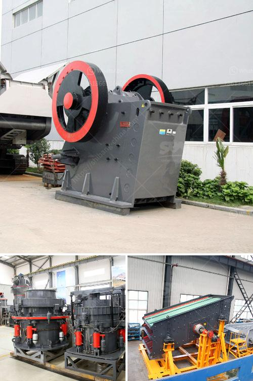

<h3>ultra fine grinder advantages</h3>
Ultra-fine grinding, also known as ultra-fine milling machine, is a kind of Raymond mill. It is widely used in the grinding process of ore materials in metallurgy, building materials, chemicals, mining minerals areas, such as various non-flammable materials of quartz, feldspar, clay, kaolin, bentonite, calcite, talc, barite, clay, gypsum which Mohs hardness is below seven degree and humidity below 6%. With the improvement of scientific and technological level, ultra-fine grinder is gradually recognized by the industry as an essential equipment for fine grinding, which can effectively improve the efficiency of materials processing and play an important role in various industries.

1. High grinding efficiency: The ultra-fine grinder adopts a highly efficient and closed-circuit grinding process, which can grind the ore to a finer particle size and improve the grinding efficiency. The fineness of the product can reach 325-2500 mesh, which can fully meet the requirements of various industries for ultra-fine powder production.

2. Wide range of application: Ultra-fine grinder can be used to grind materials with various hardness levels. It is suitable for grinding Mohs hardness below 7 and humidity below 6% of all non-flammable and explosive mineral materials. It can be widely used in metallurgy, building materials, chemicals, mining minerals and other industries.

3. Strong adaptability: Ultra-fine grinder has a wide range of grinding materials, such as quartz, feldspar, clay, kaolin, bentonite, calcite, talc, barite, clay, gypsum, fluorite, etc. The finished products are fine and uniform, and the screening rate is higher than 99%, which is suitable for various production needs.

4. Low energy consumption: Compared with traditional Raymond mills, ultra-fine grinders have lower energy consumption. The energy consumption of the ultra-fine grinder is only about 40% of the traditional mill, and the annual production can save more than 30% of the energy consumption cost.

5. Environmental protection: The ultra-fine grinder is equipped with a pulse dust collector, which greatly reduces the dust pollution and noise during the grinding process. The entire production process is green and environmentally friendly, which meets the requirements of modern environmental protection production.

6. Advanced technology: The ultra-fine grinder adopts advanced grinding technology and is equipped with high-end wear-resistant materials. The grinding roller and grinding ring are made of wear-resistant steel, which greatly improves the service life of the equipment.

In conclusion, ultra-fine grinder has significant advantages in terms of grinding efficiency, wide range of application, strong adaptability, low energy consumption, environmental protection, and advanced technology. It is an ideal choice for grinding non-flammable and explosive materials with high processing accuracy requirements. With the continuous improvement of scientific and technological level, it is believed that ultra-fine grinder will play an increasingly important role in various industries.
<h3>Contact us</h3><ul><li><strong>Whatsapp:&nbsp;<a href="https://wa.me/8613661969651">+8613661969651</a></strong></li><li><a href="https://swt.shibang-china.com/?git&amp;zhl&amp;ultra fine grinder advantages"><strong>Online Service(chat now)</strong></a></li></ul><h3>Related</h3><ul><li><a href='sales of conveyor belts.md'>sales of conveyor belts</a></li><li><a href='hammer mill santa cross.md'>hammer mill santa cross</a></li><li><a href='ultra fine grinder advantages.md'>ultra fine grinder advantages</a></li><li><a href='conveyor belting south africa.md'>conveyor belting south africa</a></li><li><a href='aggregates crushing plant in angat bulacan.md'>aggregates crushing plant in angat bulacan</a></li></ul>