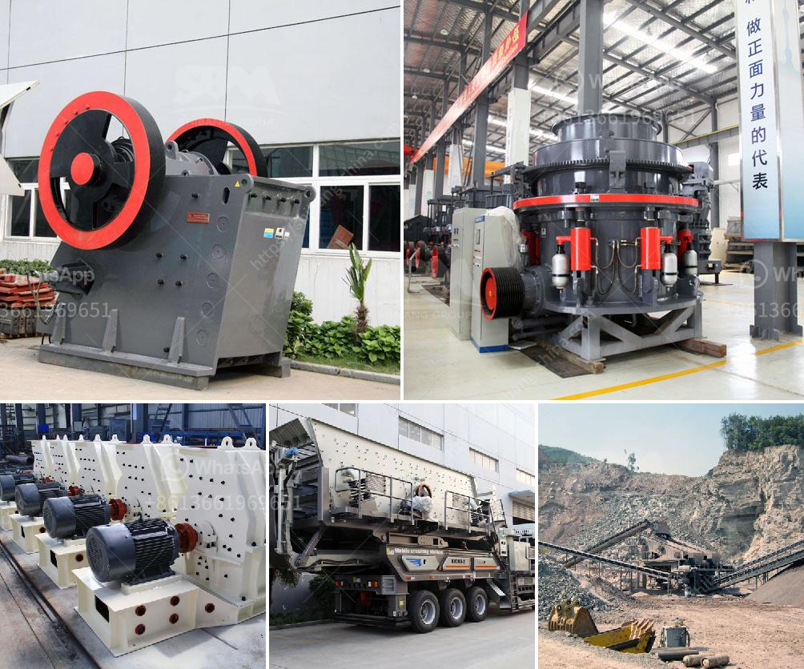

<h3>ultra fine powder grinding machine</h3>
Ultra fine powder grinding machine is a widely used machine in the industry nowadays. With the continuous development of industrial technology, the demands for ultra fine powder are increasing day by day.

Ultra fine powder grinding machine can process materials into fine powder of different finenesses, and it has wide application in industrial fields. For example, it can be used in the cement industry for raw material grinding, clinker grinding, and coal grinding. It can also be used in the metallurgical industry for blast furnace slag grinding and steel slag grinding. In addition, ultra fine powder grinding machine is widely used in the chemical industry for grinding various ores and other materials. It is also commonly used in the mining industry for grinding various minerals, such as limestone, calcite, marble, barite, kaolin, dolomite, and talc.

The ultra fine powder grinding machine has many advantages. Firstly, it has high efficiency and low energy consumption. Compared with traditional grinding machine, the ultra fine powder grinding machine can save 20%-30% energy. Secondly, it has high fineness. The fineness of ultra fine powder can reach 2000 mesh or even higher. Thirdly, it has wide range of applications. The ultra fine powder grinding machine can process various materials, such as limestone, calcite, marble, barite, kaolin, dolomite, and talc, etc. Finally, it has stable performance and long service life. The important parts of ultra fine powder grinding machine are made of high-quality materials, which ensures the machine's stability and durability.

There are several factors that affect the output and fineness of ultra fine powder grinding machine. Firstly, the hardness of the material. The harder the material is, the more difficult it is to grind, and the lower the output and fineness of the powder. Secondly, the humidity of the material. The higher the humidity of the material is, the easier it is to adhere to the grinding machine, which will affect the output and fineness of the powder. Thirdly, the size of the material. The larger the size of the material is, the longer the grinding time will be, and the lower the output and fineness of the powder.

In conclusion, ultra fine powder grinding machine is a high-efficiency and energy-saving machine with wide application in various industries. It has high fineness, stable performance, and long service life. However, there are also some factors that affect its output and fineness. Therefore, it is necessary to choose suitable materials and control the grinding time to achieve the desired effect of ultra fine powder grinding machine.
<h3>Contact us</h3><ul><li><strong>Whatsapp:&nbsp;<a href="https://wa.me/8613661969651">+8613661969651</a></strong></li><li><a href="https://swt.shibang-china.com/?git&amp;zhl&amp;ultra fine powder grinding machine"><strong>Online Service(chat now)</strong></a></li></ul><h3>Related</h3><ul><li><a href='concrete jaw crusher.md'>concrete jaw crusher</a></li><li><a href='dolomite refractory bricks process.md'>dolomite refractory bricks process</a></li><li><a href='top mining equipment supplier in south africa.md'>top mining equipment supplier in south africa</a></li><li><a href='small mining equipment price in south africa.md'>small mining equipment price in south africa</a></li><li><a href='primary and secondary crusher.md'>primary and secondary crusher</a></li></ul>