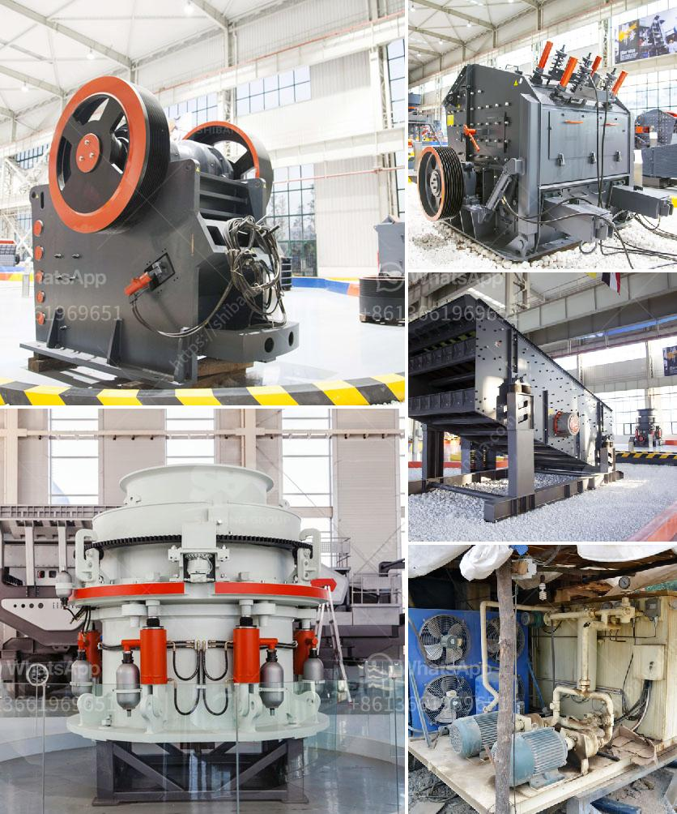

<h3>ultrafine pulverizer</h3>
The ultrafine pulverizer is a highly efficient machine used to crush and grind materials into extremely fine powder. It is designed with advanced technology and is widely used in various industries such as mining, metallurgy, chemical engineering, building materials, and pharmaceuticals.

One of the main advantages of using an ultrafine pulverizer is its ability to produce finer particles compared to other grinding machines. It can grind materials to a particle size of 1-5 microns, which is significantly smaller than what can be achieved by traditional pulverizers. This allows for a more precise and uniform product, making it ideal for applications that require high-quality and consistent output.

In addition to its particle size reduction capabilities, the ultrafine pulverizer also offers improved efficiency and productivity. Its unique design and powerful motor ensure that materials are pulverized quickly and evenly, saving time and energy during the grinding process. This results in higher production rates and reduces downtime, leading to increased profitability for businesses.

Another notable feature of the ultrafine pulverizer is its versatility. It can be used for a wide range of materials, including hard and soft minerals, fibers, and heat-sensitive substances. This makes it suitable for grinding various types of materials, such as limestone, gypsum, talc, and graphite, among others.

Furthermore, the ultrafine pulverizer is user-friendly and requires minimal maintenance. It is equipped with safety features to ensure the operator's safety and can be easily controlled and adjusted to achieve the desired particle size. This, combined with its durable construction, makes it a reliable and cost-effective solution for pulverizing materials.

In conclusion, the ultrafine pulverizer is a highly efficient grinding machine that provides precise and uniform particle size reduction. Its advanced technology, versatility, and ease of use make it an essential tool for various industries. Whether in the mining, pharmaceutical, or building materials sector, businesses can rely on the ultrafine pulverizer to achieve optimal grinding results and improve their overall productivity.
<h3>Contact us</h3><ul><li><strong>Whatsapp:&nbsp;<a href="https://wa.me/8613661969651">+8613661969651</a></strong></li><li><a href="https://swt.shibang-china.com/?git&amp;zhl&amp;ultrafine pulverizer"><strong>Online Service(chat now)</strong></a></li></ul><h3>Related</h3><ul><li><a href='operation and operation of a jaw crusher.md'>operation and operation of a jaw crusher</a></li><li><a href='cost of stone crusher in kenya.md'>cost of stone crusher in kenya</a></li><li><a href='jaw crushers china.md'>jaw crushers china</a></li><li><a href='hydraulic system vertical roller mill.md'>hydraulic system vertical roller mill</a></li><li><a href='5kg grinding ball mill.md'>5kg grinding ball mill</a></li></ul>