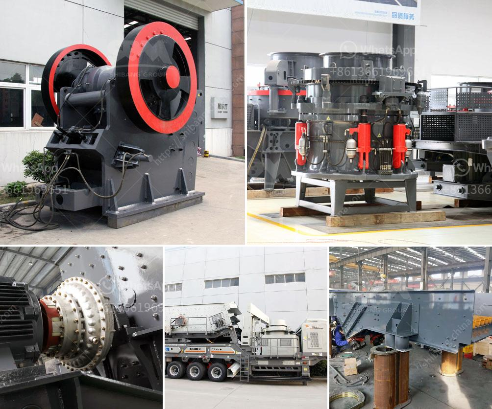

<h3>used ball mills in india</h3>
Used ball mills in India are increasingly popular among mining and processing industries. After bottlenecks have been resolved and Indian government has announced some economic reforms, the economy is rapidly growing. Consequently, the demand for new construction and infrastructure projects in India has increased significantly. This has led to a surge in the demand for raw materials such as cement, iron ore, and coal.

Ball mills are commonly used in the grinding of ceramic materials, chemical products, paints and pigments, mineral processing, electronic materials, and other industries. Ball mills crush material into various sizes and extract resources from mined materials, such as iron ore, coal, limestone, and other minerals. Ball mills are crucial equipment in grinding operations and play a vital role in recovering valuable minerals from the ore.

In India, used ball mills have become a popular choice among mining and processing industries. The reason behind this is that grinding materials and mining projects often require greater processing capabilities due to increased throughput and efficiency demands. Moreover, buying used ball mills can provide substantial cost savings compared to investing in new equipment.

The availability of used ball mills in India has also been facilitated by the presence of numerous mining and processing industries across the country. India has rich mineral resources, including iron ore, coal, bauxite, copper, limestone, and gold. These resources are essential for the growth and development of industries such as steel, cement, and power generation. Consequently, there is a steady supply of used ball mills, as many projects upgrade their equipment to meet the demands for increased efficiency and capacity.

Used ball mills in India offer several advantages. Firstly, they have a lower initial cost compared to new mills, which can be attractive to small and medium-sized companies with limited budgets. Secondly, used ball mills have been tested and proven to be reliable and efficient in grinding processes. This reduces the risk associated with purchasing new equipment that may have unforeseen issues or require additional customization. Thirdly, used ball mills are readily available and can be delivered and installed quickly, minimizing production downtime.

However, when considering used ball mills in India, it is vital to assess their condition and history. Buyers should thoroughly inspect the equipment and request detailed information regarding its previous use and maintenance history. Additionally, it is advisable to consult with experts or professional engineers who can provide guidance on the right specifications and maintenance requirements.

In conclusion, used ball mills are gaining popularity in India due to their cost-effectiveness and efficiency in grinding operations. As infrastructure development and mineral processing projects continue to grow, the demand for used ball mills is expected to rise. However, buyers must exercise caution by conducting thorough inspections and seeking expert advice to ensure they invest in reliable and quality equipment.
<h3>Contact us</h3><ul><li><strong>Whatsapp:&nbsp;<a href="https://wa.me/8613661969651">+8613661969651</a></strong></li><li><a href="https://swt.shibang-china.com/?git&amp;zhl&amp;used ball mills in india"><strong>Online Service(chat now)</strong></a></li></ul><h3>Related</h3><ul><li><a href='pebble stone processing machines.md'>pebble stone processing machines</a></li><li><a href='list gold mining equipment and machines.md'>list gold mining equipment and machines</a></li><li><a href='vibratory screen south africa.md'>vibratory screen south africa</a></li><li><a href='old used coal washing plants.md'>old used coal washing plants</a></li><li><a href='stone crusher plant ton jam.md'>stone crusher plant ton jam</a></li></ul>