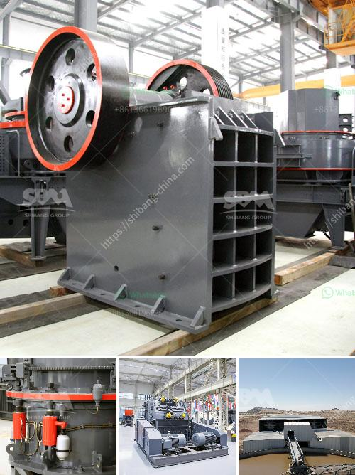

<h3>used coal grinding machine for sale in usa</h3>
Coal grinding machine falls into the category of grinding equipment that is widely used in the coal industry. The coal grinding machine is a crucial equipment for coal processing. Coal grinding mills can process the large-scale coal materials into fine powder for thermal power plant and other application.

The 300-500mm raw coal is fed into the coal grinding machine through the feeding device evenly and pulverized coal is produced at the same time. As a professional coal grinding machine manufacturer, we provide various types and models of coal grinding machines for sale. These machines have been exported to many countries, such as USA, Australia, Russia, Canada, etc.

When it comes to coal grinding machines, there are several types available. Raymond mill is the most common one, which is designed to grind or pulverize various non-flammable and non-explosive materials with hardness less than 7 and humidity less than 6%, such as barite, calcite, potash feldspar, talcum, marble, limestone, dolomite, fluorite, lime, activated clay, activated carbon, bentonite, kaolin, cement, phosphate rock, gypsum, glass, insulation materials, etc.

In addition to Raymond mill, there are other coal grinding machines available for various applications. Ball mill is also widely used for grinding coal. Ball mill is suitable for grinding all kinds of ores and other materials, no matter wet grinding or dry grinding. Besides, it is the key equipment that pulverizes the materials after they are crushed and it is widely used in the manufacturing industries, such as cement, silicate, new building materials, refractory materials, fertilizers, black and non-ferrous metal beneficiation, glass and ceramics and so on.

Coal grinding machine is a vital equipment in the coal production line. The coal fines generated by the process of mining, crushing and grinding coal are many and need to be carefully handled and managed. With the help of coal grinding machine, these coal fines can be converted into useful energy resources or turned into useful products.

In the coal grinding machine market, used coal grinding machines are the mainstream. According to statistics, the coal grinding machines sold by various suppliers are roughly divided into two categories: second-hand and new. There are many factors that determine the price of used coal grinding machines. For example, the specification and model, the age, the performance, and the brand of the equipment will all affect the price. In general, second-hand coal grinding machines are cheaper compared with new ones.

Therefore, customers who have a lower budget are more likely to choose used coal grinding machines. The price advantage is the main reason why the demand for used coal grinding machines is increasing. Of course, the quality of used coal grinding machines is also an important factor to consider when purchasing.

In conclusion, the coal grinding machine is a vital equipment in the coal processing industry and its grinding process directly affects the quality and fineness of finished products. Therefore, the coal grinding machine should be selected carefully to ensure the production efficiency and economical operation. Used coal grinding machines can be a cost-effective option for customers with a limited budget, but it is important to choose reliable suppliers to ensure the quality and performance of the equipment.
<h3>Contact us</h3><ul><li><strong>Whatsapp:&nbsp;<a href="https://wa.me/8613661969651">+8613661969651</a></strong></li><li><a href="https://swt.shibang-china.com/?git&amp;zhl&amp;used coal grinding machine for sale in usa"><strong>Online Service(chat now)</strong></a></li></ul><h3>Related</h3><ul><li><a href='prices of cement clinker grinding unit in india.md'>prices of cement clinker grinding unit in india</a></li><li><a href='ethiopia conveyor belt india.md'>ethiopia conveyor belt india</a></li><li><a href='vibrating classifiing screen.md'>vibrating classifiing screen</a></li><li><a href='japan stone crushing machines.md'>japan stone crushing machines</a></li><li><a href='quarry crusher equipment made in turkey.md'>quarry crusher equipment made in turkey</a></li></ul>