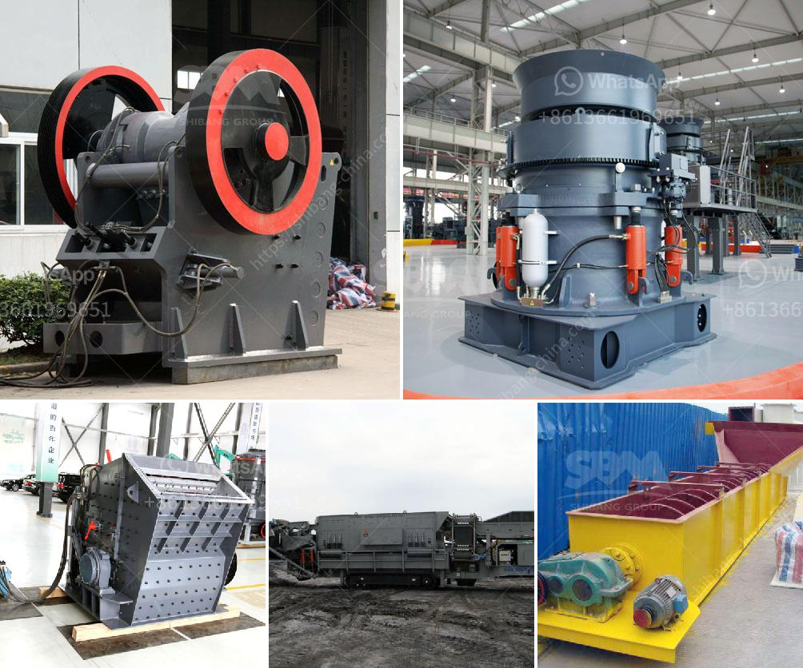

<h3>used crusher for sale in fujairah</h3>
In today's economic climate, everyone is looking for ways to save money. Whether it's cutting back on expenses, finding discounts, or searching for deals, people are finding creative ways to make their budgets stretch further. One area where cost savings can be significant is in the purchase of used equipment. This holds true for industries that require heavy machinery, such as the construction and mining sectors. In Fujairah, one of the most trusted options for finding cost-effective solutions is purchasing a used crusher.

Fujairah, located on the eastern coast of the United Arab Emirates, is a city known for its vibrant economy and bustling trade. With construction and mining projects continuously taking place in the region, the demand for crushers has skyrocketed. A crusher, also known as a rock crusher, is a machine used to break down large rocks into smaller stones or gravel. Crushers also enable the recycling of demolished concrete and asphalt, creating a valuable aggregate product for future construction projects.

When it comes to purchasing a crusher, the options are numerous. However, investing in a used crusher can provide several advantages, especially in terms of cost savings. For starters, the upfront cost of a used crusher is significantly lower compared to buying new. This can be a major incentive for businesses looking to upgrade their equipment while minimizing their expenses. Additionally, used crushers are readily available, making it easier to find the specific model that suits your requirements. This reduces the waiting time associated with ordering a new crusher and ensures that operations are not delayed.

Furthermore, used crushers for sale in Fujairah are often well-maintained and in good operational condition. Sellers typically refurbish the equipment and perform necessary repairs, ensuring that the crusher is fully functional and ready for immediate use. This allows businesses to seamlessly integrate the equipment into their operations without any major downtime or disruptions. Additionally, reputable sellers offer warranties on used crushers, providing buyers with peace of mind regarding the reliability and longevity of their purchase.

Another factor to consider when purchasing a used crusher in Fujairah is the wide variety of options available. From jaw crushers and impact crushers to cone crushers and vertical shaft impactors, there is a crusher to suit every operation and budget. Buyers can choose the specific features, capacity, and output size of the crusher that best meets their requirements. This level of customization ensures that businesses can optimize their production processes and achieve the desired results.

In conclusion, purchasing a used crusher in Fujairah can be a cost-effective solution for businesses in the construction and mining sectors. By choosing to buy used, companies can reduce their upfront costs while still acquiring reliable and well-maintained equipment. The wide variety of options available also allows for customization, ensuring that businesses can find a crusher that meets their specific requirements. With cost savings and practicality in mind, investing in a used crusher is a smart choice for those looking to maximize their budgets and improve their productivity.
<h3>Contact us</h3><ul><li><strong>Whatsapp:&nbsp;<a href="https://wa.me/8613661969651">+8613661969651</a></strong></li><li><a href="https://swt.shibang-china.com/?git&amp;zhl&amp;used crusher for sale in fujairah"><strong>Online Service(chat now)</strong></a></li></ul><h3>Related</h3><ul><li><a href='white cement manufacturing process pdf.md'>white cement manufacturing process pdf</a></li><li><a href='mobile rock crushers in ghana.md'>mobile rock crushers in ghana</a></li><li><a href='cement clinker manufacturing machine.md'>cement clinker manufacturing machine</a></li><li><a href='mobil rock pulverizer.md'>mobil rock pulverizer</a></li><li><a href='wet ball milling process.md'>wet ball milling process</a></li></ul>