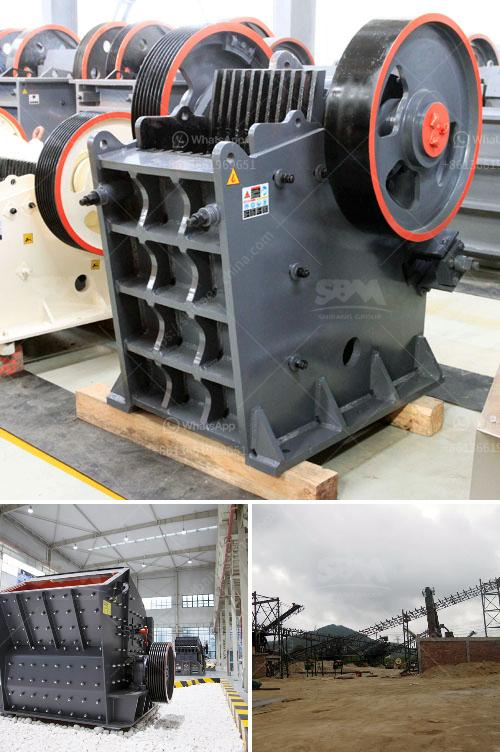

<h3>used crusher for sale in south africa</h3>
The mining industry in South Africa has been a key driver of economic growth and development, contributing significantly to employment, infrastructure development, and technological advancement. However, the sector has faced various challenges in recent years, including declining ore grades, rising costs, and tough regulatory frameworks.

In light of these challenges, many mining companies are turning to the used crusher market to acquire reliable and cost-effective crushing equipment. One such company that has embraced this solution is Telsmith Crushing & Screening Plant, a South African manufacturer of crushing and screening equipment for the mining industry.

With a rich heritage of design and manufacturing excellence, Telsmith is a leading provider of crushing equipment that is robust, reliable, and designed to withstand the tough conditions encountered in the mining industry. The company's range of jaw crushers, cone crushers, and impact crushers have been used successfully in various mining applications in South Africa and around the world.

Telsmith understands that customers require high-performance crushing equipment that maximizes productivity and minimizes operating costs. By offering quality refurbished crushers at reasonable prices, Telsmith has become a trusted supplier in the used crusher market.

One of the advantages of purchasing refurbished crushers is the ability to obtain warranty coverage and comprehensive after-sales support. Telsmith ensures that all its used crushers go through a thorough inspection and refurbishment process to guarantee their performance and reliability. This gives customers peace of mind, knowing that their investment is protected and that they can rely on the equipment to perform optimally.

In addition to providing robust and reliable used crushers, Telsmith also offers a full range of services to support customers throughout the crusher lifecycle. These services include technical support, spare parts availability, equipment upgrades, and regular maintenance. By partnering with Telsmith, mining companies can optimize their crusher operations and minimize downtime, thus improving overall productivity and profitability.

The used crusher market in South Africa is on the rise, driven by factors such as substantial cost savings, ease of operation, and reduced environmental impact. This trend is particularly evident in the quarrying sector, where a high demand for quality aggregates is driving the need for cost-effective solutions.

Telsmith Crushing & Screening Plant, a leading provider of used crushers and related equipment, offers a comprehensive range of solutions to help customers meet their specific crushing requirements. Whether for primary, secondary, or tertiary crushing applications, Telsmith crushers deliver high performance, reliability, and cost-efficiency.

As the mining industry continues to face challenges, the need for cost-effective solutions becomes more important than ever. Through its range of quality refurbished crushers and comprehensive after-sales support, Telsmith is well-positioned to meet the growing demand for used crushers in South Africa and beyond. By embracing the used crusher market, mining companies can achieve significant cost savings, improve operational efficiency, and contribute to a sustainable future for the industry.
<h3>Contact us</h3><ul><li><strong>Whatsapp:&nbsp;<a href="https://wa.me/8613661969651">+8613661969651</a></strong></li><li><a href="https://swt.shibang-china.com/?git&amp;zhl&amp;used crusher for sale in south africa"><strong>Online Service(chat now)</strong></a></li></ul><h3>Related</h3><ul><li><a href='cheap concrete crusher sale kenya.md'>cheap concrete crusher sale kenya</a></li><li><a href='mini mining crusher dealers.md'>mini mining crusher dealers</a></li><li><a href='large scale basalt rock crusher.md'>large scale basalt rock crusher</a></li><li><a href='high performance mobile crushing machine for sale.md'>high performance mobile crushing machine for sale</a></li><li><a href='crusher equipment price.md'>crusher equipment price</a></li></ul>