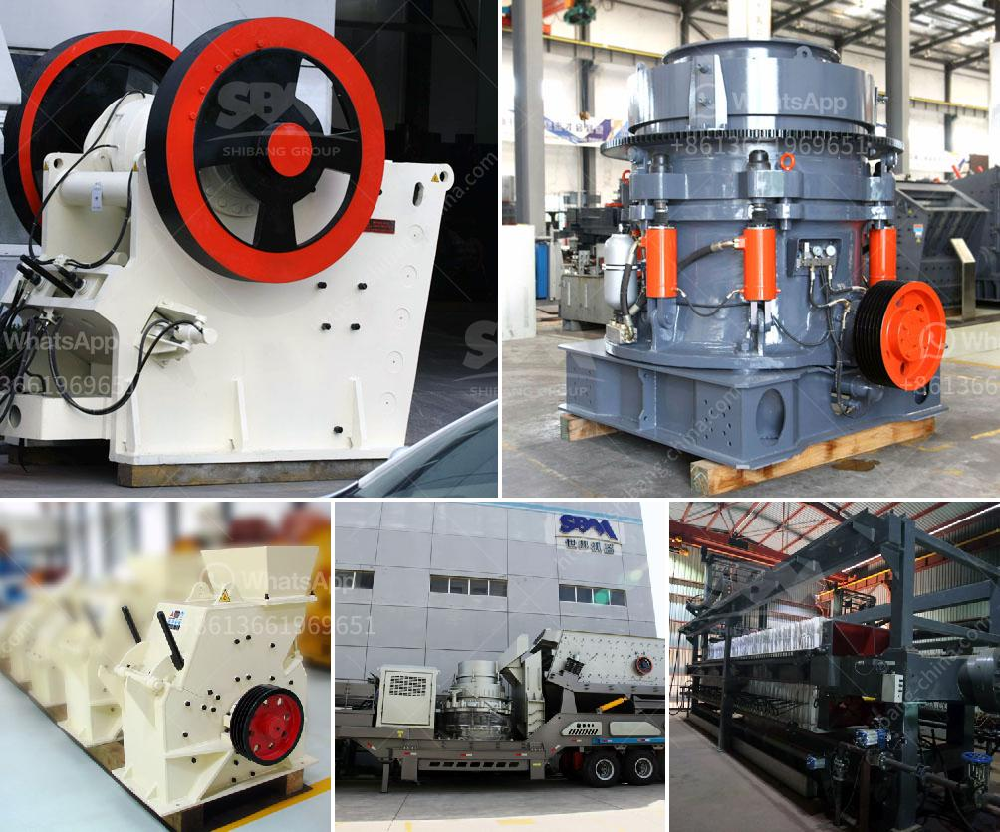

<h3>used crusher for sale kenya</h3>
Are you in the construction industry in Kenya and looking for cost-effective solutions for crushing tasks? Look no further because there are plenty of used crushers for sale in Kenya that can help you meet your crushing needs. These pre-owned machines can effectively process various materials such as granite, limestone, basalt, quartz, iron ore, and many more.

One of the advantages of purchasing used crushers is the significant cost savings compared to buying new equipment. Pre-owned crushers are usually available at a fraction of the original price, making them a more affordable option for businesses with budget constraints. Additionally, these machines are usually well-maintained and can still deliver optimal performance.

Used crushers in Kenya come in different types and sizes to cater to various crushing requirements. Jaw crushers are perfect for primary crushing tasks, while cone crushers and impact crushers are commonly used for secondary and tertiary crushing. These machines are robust and durable, designed to handle demanding conditions and ensure high productivity.

When purchasing a used crusher, it is crucial to inspect the machine thoroughly to ensure it meets your specific requirements. Look for signs of wear and tear, check the engine and hydraulic systems, and test the machine under load to assess its overall functionality. It is also recommended to request service records and maintenance history to have a better understanding of the machine's past performance.

Before making a final decision, it is advisable to compare prices, conditions, and specifications of different used crushers available in the market. Consult with knowledgeable professionals or experts to ensure you make an informed choice.

In conclusion, if you are in the construction industry in Kenya and need a cost-effective solution for crushing tasks, consider purchasing a used crusher. These machines offer significant cost savings, are well-maintained, and can handle various materials with ease. Conduct thorough inspections and comparisons before making a purchase to ensure you find the right machine for your specific needs. With a reliable used crusher, you can enhance productivity and efficiency in your operations.
<h3>Contact us</h3><ul><li><strong>Whatsapp:&nbsp;<a href="https://wa.me/8613661969651">+8613661969651</a></strong></li><li><a href="https://swt.shibang-china.com/?git&amp;zhl&amp;used crusher for sale kenya"><strong>Online Service(chat now)</strong></a></li></ul><h3>Related</h3><ul><li><a href='conical ball mill for sale.md'>conical ball mill for sale</a></li><li><a href='grinding cost calculation for bm 8 usha mill.md'>grinding cost calculation for bm 8 usha mill</a></li><li><a href='the estimated cost of setting up a quarry.md'>the estimated cost of setting up a quarry</a></li><li><a href='basalt processing line.md'>basalt processing line</a></li><li><a href='basalt fiber production lines.md'>basalt fiber production lines</a></li></ul>