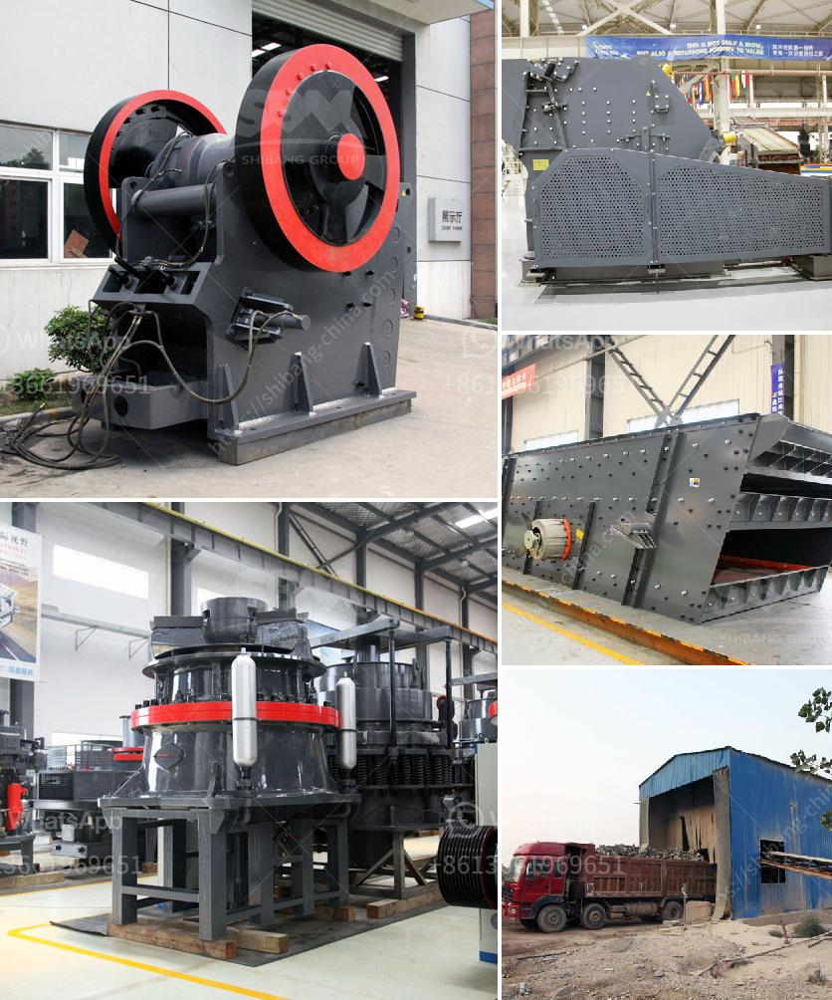

<h3>used crusher for sale sell buy</h3>
Are you in need of a new crusher for your mining or construction business? Or perhaps you are looking to upgrade your existing crusher to increase productivity? Whatever your requirements may be, buying a used crusher for sale can be a cost-effective solution.

When it comes to buying used crushers, there are a few crucial factors to consider. Firstly, the condition of the crusher is essential. A used crusher may be in excellent working condition, but it is important to verify this before making a purchase. Check for any signs of wear or damage and ensure that all mechanical components are functioning properly.

Secondly, it is important to consider the specifications and capacity of the crusher. Ensure that the used crusher meets your specific requirements in terms of feed size, output capacity, and power consumption. This will help you determine if the crusher can efficiently handle your workload and optimize your operations.

Another critical aspect to consider is the maintenance and service history of the used crusher. Request detailed records of any previous repairs or maintenance performed on the equipment. This will give you an idea of how well the crusher has been maintained and help you identify any potential future issues.

Furthermore, it is advisable to inspect the crusher in person before making a purchase. This will allow you to physically examine the equipment and ensure that it meets your expectations. Additionally, it is beneficial to have a professional inspect the crusher to provide an unbiased assessment of its condition and functionality.

Finally, when it comes to buying a used crusher, buying from a reputable seller is key. Look for sellers with a proven track record in the industry and positive customer reviews. This will give you confidence that you are purchasing a reliable piece of equipment.

In conclusion, buying a used crusher for sale can be a cost-effective solution for your business. However, it is imperative to thoroughly inspect the equipment, consider the specifications and maintenance history, and purchase from a reputable seller. By doing your due diligence, you can ensure that you are making a wise investment that will benefit your operations for years to come.
<h3>Contact us</h3><ul><li><strong>Whatsapp:&nbsp;<a href="https://wa.me/8613661969651">+8613661969651</a></strong></li><li><a href="https://swt.shibang-china.com/?git&amp;zhl&amp;used crusher for sale sell buy"><strong>Online Service(chat now)</strong></a></li></ul><h3>Related</h3><ul><li><a href='japan stone crushing machines.md'>japan stone crushing machines</a></li><li><a href='mobile crushers south africa.md'>mobile crushers south africa</a></li><li><a href='hydraulic cone crusher application.md'>hydraulic cone crusher application</a></li><li><a href='stone crushing quarry works with conveyor belt.md'>stone crushing quarry works with conveyor belt</a></li><li><a href='how to make a stone breaker.md'>how to make a stone breaker</a></li></ul>