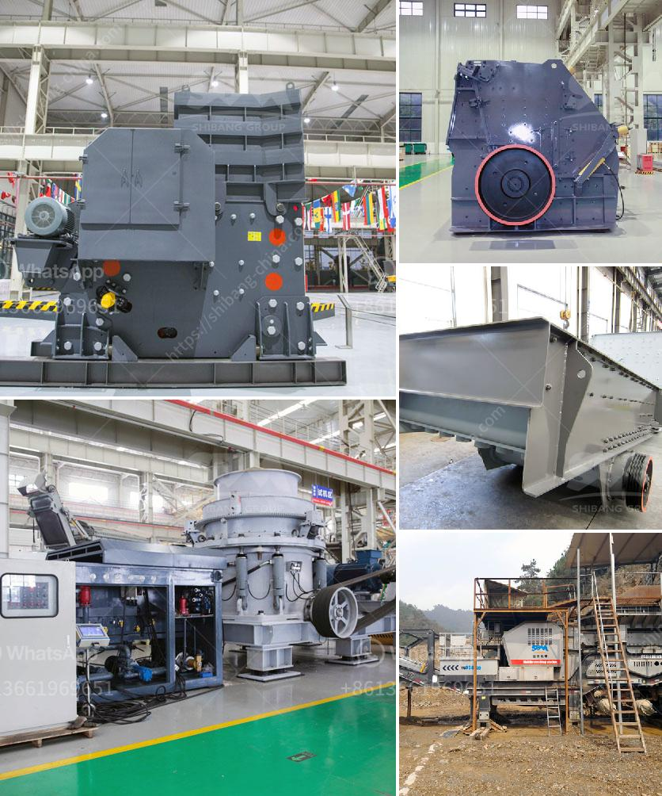

<h3>used crusher plants on sale in uae</h3>
The United Arab Emirates (UAE) is one of the largest producers of crushed stone and construction aggregate in the Middle East. With a booming construction industry, the UAE is a hub for infrastructure development projects, making it a lucrative market for sellers of used crusher plants.

Crusher plants are specially designed machines that reduce the size of raw materials to smaller sizes for further processing or for end-use. These machines are widely used in industries such as mining, metallurgy, construction, and recycling. In the UAE, crusher plants are usually used at stone quarries to crush large stones into smaller pieces for aggregates production.

Many companies in the UAE have realized the cost-saving benefits of purchasing used crusher plants instead of investing in new ones. Buying used crusher plants offers several advantages over buying new plants. First and foremost, it saves a significant amount of money as used crusher plants are generally priced lower than new ones. Additionally, used plants are readily available in the market, allowing buyers to get their hands on the equipment quickly and start their operations without any delay.

One of the top reasons why used crusher plants are in demand in the UAE is their low operational cost. Used plants are often already set up and operational, requiring minimal adjustments or modifications. This translates into substantial savings on installation costs and time. Moreover, used crusher plants have a proven track record of performance, making them a reliable option for buyers who want to minimize downtime and maximize productivity.

The market for used crusher plants in the UAE is highly competitive, with numerous sellers offering a wide range of options to buyers. It is crucial for buyers to thoroughly research and evaluate their requirements before making a purchase. Factors such as the specific application, desired capacity, and size of the materials to be crushed should be taken into consideration when selecting a used crusher plant.

To ensure a successful purchase, buyers should also inspect the condition of the used crusher plant before finalizing the deal. This includes evaluating the overall structure, inspecting the main components such as the crusher chamber and conveyor belts, and checking for any signs of wear and tear. Buyers may also consider requesting a trial run or test session to witness the performance of the plant in person.

In conclusion, used crusher plants on sale in the UAE provide buyers with a cost-effective and reliable solution for their crushing needs. The UAE's booming construction industry and the need for high-quality aggregates have created a lucrative market for used crusher plants. Buyers should carefully evaluate their requirements, select a suitable plant, and thoroughly inspect its condition before making a purchase. With the right choice, buyers can benefit from significant cost and time savings while ensuring efficient and reliable crushing operations.
<h3>Contact us</h3><ul><li><strong>Whatsapp:&nbsp;<a href="https://wa.me/8613661969651">+8613661969651</a></strong></li><li><a href="https://swt.shibang-china.com/?git&amp;zhl&amp;used crusher plants on sale in uae"><strong>Online Service(chat now)</strong></a></li></ul><h3>Related</h3><ul><li><a href='machinery needed for limestone extraction.md'>machinery needed for limestone extraction</a></li><li><a href='processing of delomite powder mill.md'>processing of delomite powder mill</a></li><li><a href='mobile crushers south africa.md'>mobile crushers south africa</a></li><li><a href='vibrating screen efficiency.md'>vibrating screen efficiency</a></li><li><a href='fine powder grinding mill.md'>fine powder grinding mill</a></li></ul>