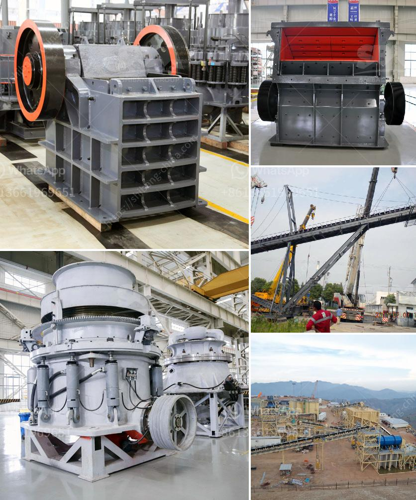

<h3>used crusher price in nigeria</h3>
Nigeria is one of the largest oil-producing countries in the world, with abundant reserves of petroleum, natural gas, coal, iron ore, limestone, and other minerals. With the rapid development of the country's construction industry, the demand for crushing machines is increasing, which drives the development of the crusher market in Nigeria.

The crusher market in Nigeria has been growing rapidly due to the widespread use of crushers in various sectors such as mining, infrastructure, building materials, and construction. Crushers are used for crushing stones or other hard materials into smaller pieces to be used for construction purposes. They are essential equipment in the construction industry and play a vital role in accelerating the country's development.

When it comes to purchasing a crusher, cost is always a significant factor to consider. In Nigeria, the price of used crushers is relatively low compared to new ones. This is mainly because used crushers were previously owned by construction companies or individuals who no longer need them, and they are sold at a lower price to recover a portion of the investment.

The price of used crushers in Nigeria depends on several factors, including the brand, model, capacity, production capacity, and condition of the crusher. Generally, used crushers are cheaper than new ones, as the initial depreciation cost is already borne by the original buyer. However, it is important to note that the price can vary depending on the sellers' negotiation skills, market demand, and availability.

The commonly used crushers in Nigeria include jaw crushers, cone crushers, impact crushers, and mobile crushers. Each type of crusher has its advantages and can be used for various applications. Jaw crushers are primarily used for coarse crushing of stones, while cone crushers are commonly used for secondary and tertiary crushing. Impact crushers are suitable for crushing materials with medium hardness, and mobile crushers provide flexibility and convenience for onsite crushing operations.

In Nigeria, the price of used crushers can range from a few thousand dollars to several hundred thousand dollars. It is recommended to compare prices from different sellers and consider the condition, maintenance history, and warranty of the crusher before making a purchase decision. Additionally, buyers should also consider the availability of spare parts and the proximity of service centers to ensure timely repairs and maintenance.

Furthermore, it is advisable to consult with experts or professionals in the field to get a better understanding of the crusher market in Nigeria and make an informed decision. They can provide valuable insight into the quality, performance, and durability of different crusher models and help buyers select the most suitable one for their specific needs.

In conclusion, the price of used crushers in Nigeria is relatively low compared to new ones. However, buyers should consider various factors such as brand, model, capacity, condition, and availability of spare parts before making a purchase. By doing thorough research and consulting with experts, buyers can find high-quality used crushers at competitive prices, contributing to their success in the construction industry and the overall development of Nigeria.
<h3>Contact us</h3><ul><li><strong>Whatsapp:&nbsp;<a href="https://wa.me/8613661969651">+8613661969651</a></strong></li><li><a href="https://swt.shibang-china.com/?git&amp;zhl&amp;used crusher price in nigeria"><strong>Online Service(chat now)</strong></a></li></ul><h3>Related</h3><ul><li><a href='mini crusher hire johannesburg.md'>mini crusher hire johannesburg</a></li><li><a href='dorries vertical grinders used for sale europe.md'>dorries vertical grinders used for sale europe</a></li><li><a href='mobile stone crushing machine in america.md'>mobile stone crushing machine in america</a></li><li><a href='small gravel crusher machine ethiopia.md'>small gravel crusher machine ethiopia</a></li><li><a href='consumption ratio for ball mill.md'>consumption ratio for ball mill</a></li></ul>