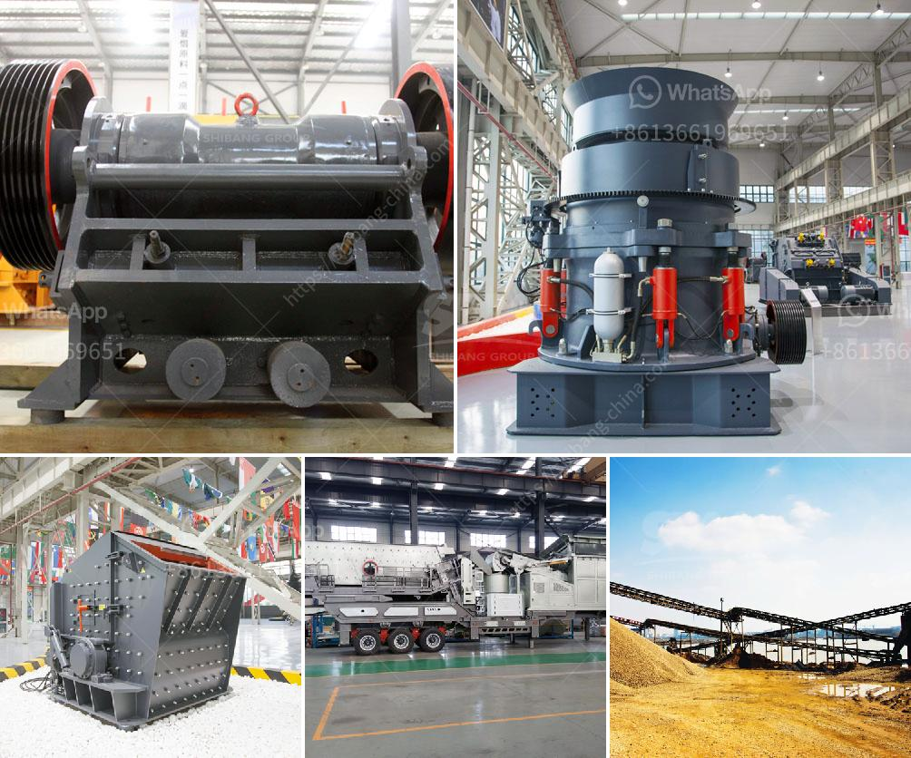

<h3>used crushing plant for sale</h3>
Are you in need of a crushing plant, but have a tight budget? Consider purchasing a used crushing plant! A used crushing plant offers great value for money, allowing you to get a high-performing machine at a significantly lower price compared to a brand new one.

When looking for a used crushing plant for sale, it is important to carefully inspect the equipment to ensure it is in good working condition. Check the overall condition of the machine, including the engine, belts, and hydraulic system. Look for any signs of wear and tear, as well as any leaks or damages that might affect its performance.

Another crucial aspect to consider is the age and usage of the crushing plant. Look for a machine that has been well-maintained and serviced regularly, as this indicates that it has been taken care of properly. It is also advisable to ask for the maintenance records to get a better idea of how the machine has been used and maintained over time.

One of the advantages of buying a used crushing plant is that you can often find models that are no longer available in the market. Some older models are known for their durability and strong performance, making them a great choice for those looking for a reliable machine.

In addition to the cost savings, buying a used crushing plant allows you to start your operations faster. Instead of waiting for a new machine to arrive, you can get your production up and running immediately.

However, it is crucial to buy from a reputable seller or dealer to ensure you are getting a quality machine. Do thorough research and read customer reviews before making a final decision.

In conclusion, a used crushing plant is a great option for those looking to maximize their budget while still getting a high-quality machine. By inspecting the condition, age, and usage of the equipment, you can make an informed decision and find the perfect crushing plant for your needs. Start exploring the used crushing plant market and find the best deal for you!
<h3>Contact us</h3><ul><li><strong>Whatsapp:&nbsp;<a href="https://wa.me/8613661969651">+8613661969651</a></strong></li><li><a href="https://swt.shibang-china.com/?git&amp;zhl&amp;used crushing plant for sale"><strong>Online Service(chat now)</strong></a></li></ul><h3>Related</h3><ul><li><a href='cost of grinding mill.md'>cost of grinding mill</a></li><li><a href='robinson henry roller mills.md'>robinson henry roller mills</a></li><li><a href='denver roll crusher for sale.md'>denver roll crusher for sale</a></li><li><a href='buy crusher of impact of 10 tph.md'>buy crusher of impact of 10 tph</a></li><li><a href='coal washing process machine.md'>coal washing process machine</a></li></ul>