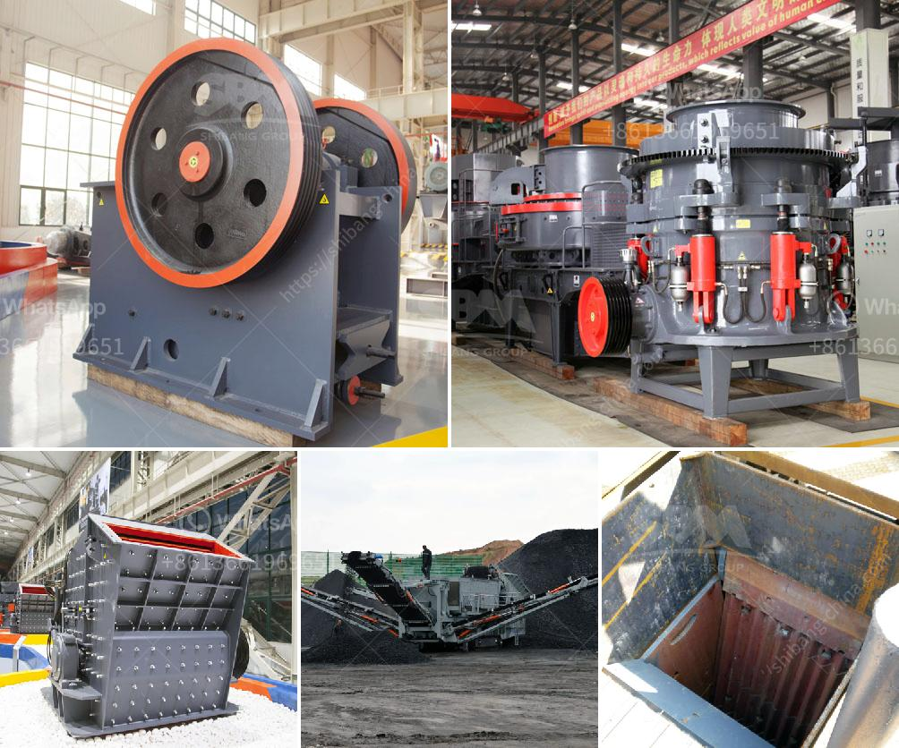

<h3>used crushing plant in sweden or norwey</h3>
When it comes to the efficient disposal of large amounts of construction waste, recycling materials, and various other operations, nothing beats the efficiency and reliability of a used crushing plant. In Sweden and Norway, the availability of such plants is plentiful, making them an ideal choice for contractors, construction companies, and other industries.

A used crushing plant refers to any type of plant that has been previously operated or utilized for crushing stones, rocks, or any other materials. These plants are often sold by construction companies or demolition contractors who no longer have use for them. Despite being previously used, these plants are often in excellent condition, as they are built to withstand heavy-duty operations.

One of the key advantages of opting for a used crushing plant is the cost savings it offers. Compared to purchasing a brand-new plant, used ones are significantly more affordable. This makes it a practical choice for small and medium-sized businesses that are looking to expand their operations without breaking the bank.

In Sweden and Norway, there is a wide variety of used crushing plants available, including jaw crushers, impact crushers, and cone crushers. Typically, these used machines are assembled on a trailer mounted frame, meaning they are easy to transport to various locations around the site or to other sites altogether.

Moreover, the ready availability of used crushing plants in Sweden and Norway means that contractors and companies can find the specific type of plant that suits their needs and requirements. Whether it's a plant with a higher capacity for larger projects or a more compact one for smaller operations, there are options available for every situation.

When purchasing a used crushing plant, it is essential to inspect and verify its condition. This is usually done by conducting inspections or requesting details about the plant's history, maintenance records, and any repairs or replacements that have been made. This information ensures that the plant is in good working order and capable of delivering the necessary performance.

In conclusion, opting for a used crushing plant in Sweden or Norway offers several advantages. These plants are cost-effective, readily available, and capable of handling a wide range of materials. From construction waste to recycling operations, a used crushing plant can significantly enhance productivity while minimizing costs for businesses in these countries.
<h3>Contact us</h3><ul><li><strong>Whatsapp:&nbsp;<a href="https://wa.me/8613661969651">+8613661969651</a></strong></li><li><a href="https://swt.shibang-china.com/?git&amp;zhl&amp;used crushing plant in sweden or norwey"><strong>Online Service(chat now)</strong></a></li></ul><h3>Related</h3><ul><li><a href='jual crusher batubara di indonesia.md'>jual crusher batubara di indonesia</a></li><li><a href='simple stone crushers kenya.md'>simple stone crushers kenya</a></li><li><a href='dolomite grinding machine.md'>dolomite grinding machine</a></li><li><a href='rotary kiln producers in indonesia.md'>rotary kiln producers in indonesia</a></li><li><a href='crusher conveyor belt.md'>crusher conveyor belt</a></li></ul>