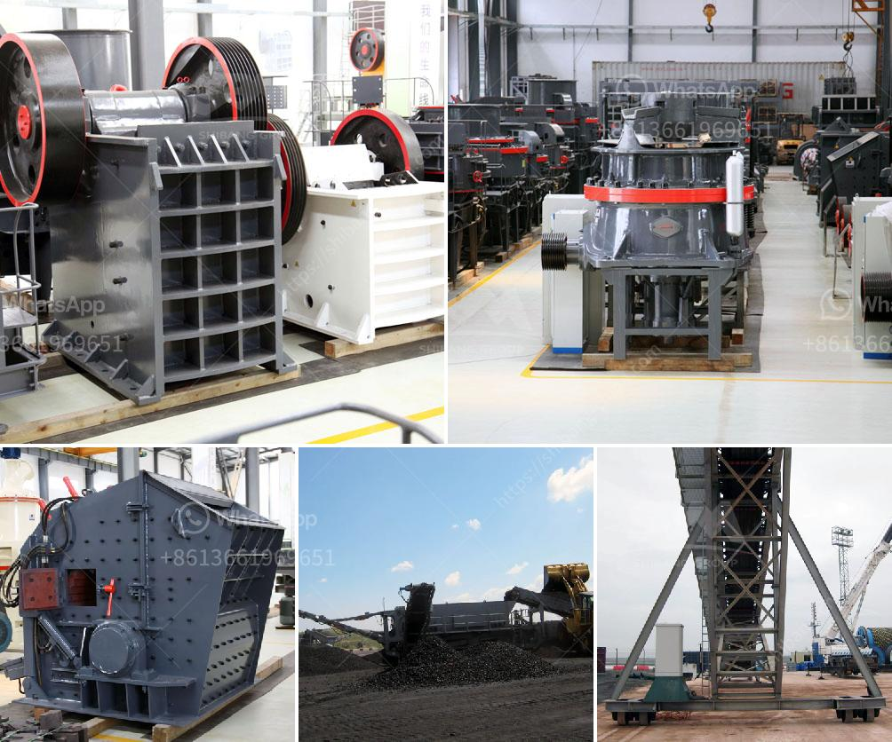

<h3>used crushing plant johannesburg</h3>
When it comes to efficiently completing large construction projects, having a reliable and cost-effective crushing plant is of utmost importance. In Johannesburg, South Africa, used crushing plants have become an increasingly popular choice for construction companies due to their affordability and efficiency. With countless benefits, using a used crushing plant in Johannesburg can significantly reduce costs and maximize productivity for construction projects.

Johannesburg, known as the economic hub of South Africa, is home to numerous construction projects. From road construction to building developments, the demand for high-quality aggregate materials continues to increase. This is where a used crushing plant comes into play – it helps in breaking down large rocks and stones into smaller pieces, which are then used for various construction purposes, such as making concrete or asphalt.

One of the biggest advantages of using a used crushing plant in Johannesburg lies in its cost-effectiveness. Construction companies often have tight budgets and need to find ways to cut costs without compromising the quality of work. Purchasing a used crushing plant can significantly reduce the initial investment compared to buying a new plant. This allows businesses to allocate more resources to other critical areas of the project, such as labor or equipment maintenance.

Another benefit of using a used crushing plant is its availability. In Johannesburg, there is a wide range of options available in the used machinery market. Construction companies can select a plant that best suits their specific project requirements, whether it is a stationary or mobile plant. This versatility ensures that businesses can find a solution that fits their needs perfectly without having to compromise on quality or productivity.

Furthermore, used crushing plants in Johannesburg offer a quicker setup time compared to new ones. As the plant has been previously used, it may already be partially assembled, allowing for faster installation on-site. This not only saves time but also minimizes disruption to the construction schedule, enabling projects to progress smoothly.

Operating costs are also reduced when using a used crushing plant in Johannesburg. These plants are designed to consume less fuel, resulting in lower fuel expenses. Additionally, regular maintenance and spare parts for used plants are generally more affordable compared to new ones, contributing to long-term cost savings.

Choosing a reputable supplier of used crushing plants in Johannesburg is crucial to ensure the quality and reliability of the equipment. Companies should thoroughly research and inspect the machinery, checking for any signs of wear or damage. Refurbished plants are often the ideal choice, as they have undergone thorough inspection and necessary repairs to bring them back to optimal working condition.

In conclusion, for construction companies in Johannesburg seeking a cost-effective and efficient solution for their crushing needs, used crushing plants are the way to go. The availability, affordability, and reduced operating costs make these plants an attractive option. By harnessing the benefits provided by a used crushing plant, businesses can maximize productivity while minimizing expenses, ultimately leading to successful project completion and client satisfaction.
<h3>Contact us</h3><ul><li><strong>Whatsapp:&nbsp;<a href="https://wa.me/8613661969651">+8613661969651</a></strong></li><li><a href="https://swt.shibang-china.com/?git&amp;zhl&amp;used crushing plant johannesburg"><strong>Online Service(chat now)</strong></a></li></ul><h3>Related</h3><ul><li><a href='small jaw crusher for sale in california.md'>small jaw crusher for sale in california</a></li><li><a href='grinding mill plant cost.md'>grinding mill plant cost</a></li><li><a href='mine to mill optimization and reconciliation.md'>mine to mill optimization and reconciliation</a></li><li><a href='high performance mobile crushing machine for sale.md'>high performance mobile crushing machine for sale</a></li><li><a href='calcium carbonate powder crushing crusher usa.md'>calcium carbonate powder crushing crusher usa</a></li></ul>