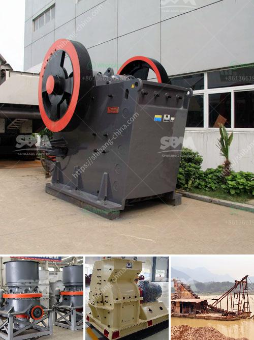

<h3>used gold washing machines</h3>
When it comes to searching for gold, artisanal miners and hobbyists understand the importance of having the right equipment. One essential tool in their arsenal is a gold washing machine. However, investing in a brand-new machine can often be costly, especially for those just starting in the mining industry. Thankfully, there is a sustainable and affordable solution: used gold washing machines.

Used gold washing machines offer several advantages to those looking to outfit their gold mining ventures without breaking the bank. Firstly, affordability is a significant factor. By purchasing a pre-owned machine, miners can save a substantial amount of money, sometimes up to 50% of the cost of a brand-new washing machine. This is especially beneficial for small-scale miners or hobbyists who may have limited financial resources. By acquiring a used machine, they can allocate more funds towards essential mining supplies or necessary permits.

Moreover, used gold washing machines are an environmentally-friendly choice. By opting for second-hand equipment, miners are effectively extending the lifespan of these machines and reducing waste. Rather than ending up in a landfill, these machines find new life in the hands of others, promoting a sustainable mining industry. Additionally, the carbon footprint associated with manufacturing new equipment is greatly reduced through the repurposing of existing machines.

Despite their pre-owned status, used gold washing machines can still deliver excellent performance. Many machines on the market undergo thorough inspections and refurbishments by trusted sellers to ensure they are in good working condition. This provides buyers with peace of mind and confidence in their purchase, knowing that the machine they acquire is reliable and will help them achieve optimal gold recovery.

In conclusion, used gold washing machines provide a sustainable and affordable option for artisanal miners and hobbyists. By choosing pre-owned equipment, miners can save money, reduce waste, and minimize their environmental impact. These machines, even after being used by others, can still deliver reliable performance and contribute to successful gold mining ventures. So, whether you're just starting or looking to expand your operations, consider the benefits of a used gold washing machine for a cost-effective and sustainable approach to your gold recovery needs.
<h3>Contact us</h3><ul><li><strong>Whatsapp:&nbsp;<a href="https://wa.me/8613661969651">+8613661969651</a></strong></li><li><a href="https://swt.shibang-china.com/?git&amp;zhl&amp;used gold washing machines"><strong>Online Service(chat now)</strong></a></li></ul><h3>Related</h3><ul><li><a href='hammer mill mining south africa.md'>hammer mill mining south africa</a></li><li><a href='gold wash plant irs california.md'>gold wash plant irs california</a></li><li><a href='impact crushers saudi.md'>impact crushers saudi</a></li><li><a href='used crusher for sale in south africa.md'>used crusher for sale in south africa</a></li><li><a href='differnce between raw mill and ball mill.md'>differnce between raw mill and ball mill</a></li></ul>