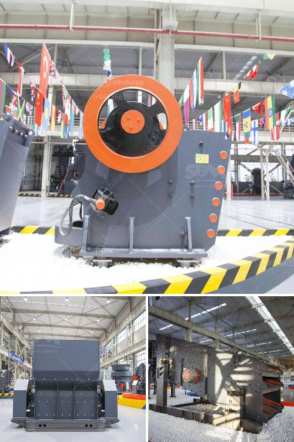

<h3>used grinding mill equipment</h3>
In the world of industrial production, grinding processes play a crucial role in achieving the desired quality and efficiency. Whether it's grinding raw materials for cement production, pulverizing minerals for mining applications, or reducing solid materials into fine powders, grinding mills are essential equipment for various industries.

However, acquiring brand-new grinding mill equipment can be a substantial investment for many businesses. This is where used grinding mill equipment becomes an affordable and efficient solution. With advances in technology and evolving market demands, there is a constant influx of quality used equipment available, offering numerous benefits to businesses.

One of the most significant advantages of purchasing used grinding mill equipment is the cost savings. Used equipment is typically priced significantly lower than new machinery, allowing businesses to allocate their budget to other areas of operation, such as expanding production capacity, upgrading existing machinery, or investing in research and development. The cost savings can be substantial, enabling businesses to procure high-quality equipment without compromising on performance.

Moreover, used grinding mill equipment offers the added advantage of immediate availability. Unlike purchasing new machinery, which often involves lead times and waiting for delivery, used equipment is readily accessible. This allows businesses to quickly implement necessary upgrades or replacements, minimizing downtime and ensuring continuous production. For industries with time-sensitive processes, such as mining or construction, this ability to acquire equipment swiftly can be vital in meeting demanding project deadlines.

Another benefit of opting for used grinding mill equipment is the opportunity to source high-quality and reliable machinery. Reputable suppliers thoroughly inspect and refurbish used equipment, ensuring it meets stringent performance and safety standards. By purchasing from reputable sellers, businesses can have peace of mind knowing that the equipment is reliable, fully operational, and has withstood rigorous testing to ensure its optimal performance.

Furthermore, used grinding mill equipment often comes with additional accessories and spare parts. This is particularly advantageous for businesses that utilize specific configurations or require customization for their specific applications. The availability of spare parts can reduce maintenance costs and ensure uninterrupted production, as businesses can readily replace any worn or damaged components.

Sustainability is another critical aspect to consider when purchasing used grinding mill equipment. By opting for used machinery, businesses contribute to reducing environmental impact. The extension of a machine's lifecycle through reuse helps to conserve precious resources and minimize waste. Additionally, the reduction in industrial waste created during the manufacturing process of new equipment is beneficial for the environment.

In conclusion, used grinding mill equipment offers an affordable and efficient solution for businesses in need of high-quality machinery. The cost savings, immediate availability, and reliable performance make it an attractive option for various industries. Moreover, the availability of spare parts and the sustainability aspect further enhance the appeal of used equipment. With these advantages in mind, businesses can make informed decisions when considering used grinding mill equipment, ensuring their operations run smoothly and efficiently.
<h3>Contact us</h3><ul><li><strong>Whatsapp:&nbsp;<a href="https://wa.me/8613661969651">+8613661969651</a></strong></li><li><a href="https://swt.shibang-china.com/?git&amp;zhl&amp;used grinding mill equipment"><strong>Online Service(chat now)</strong></a></li></ul><h3>Related</h3><ul><li><a href='how vertical roller mill works.md'>how vertical roller mill works</a></li><li><a href='stone crusher with tractor.md'>stone crusher with tractor</a></li><li><a href='central shaft for stone crusher.md'>central shaft for stone crusher</a></li><li><a href='high chrome impact crusher spare parts.md'>high chrome impact crusher spare parts</a></li><li><a href='list gold mining equipment and machines.md'>list gold mining equipment and machines</a></li></ul>