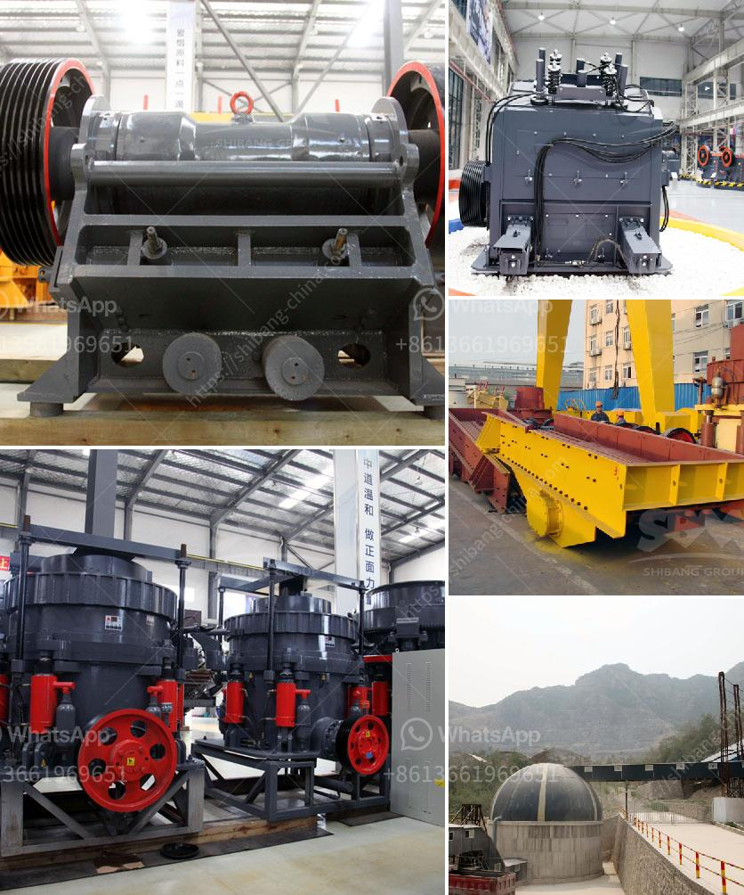

<h3>used hammer crusher</h3>
In various industries, making the most of resources and reducing operating costs are key factors in staying competitive. The mining, construction, and demolition industries are no exception. These industries require heavy machinery to break down large materials into smaller, more manageable pieces. One such machine that is widely used for this purpose is the hammer crusher.

A hammer crusher, also known as a hammer mill or hammer mill crusher, is a crushing machine that crushes materials with a high-speed rotating hammer. This type of crusher is used for various materials, including coal, limestone, gypsum, clay, brick, and tile.

One of the reasons why the hammer crusher is so popular in these industries is its ability to crush materials into specific sizes. Depending on the application, the hammer crusher can produce particles ranging from coarse to fine. This makes it perfect for a wide range of industries and applications, including mining, construction, and demolition.

Additionally, the hammer crusher is known for its simplicity and ease of operation. Unlike other crushers, which often require skilled operators to ensure proper operation, the hammer crusher can be operated by anyone with minimal training. It is a straightforward machine that does not require complex adjustments or settings.

One significant advantage of using a used hammer crusher is its cost-effectiveness. With new machinery being expensive, many businesses in these industries prefer to invest in used equipment. Buying a used hammer crusher can save a significant amount of money without compromising on performance or quality. Many used hammer crushers are still in excellent condition and can provide years of reliable service.

Moreover, the maintenance and operational costs of a used hammer crusher are generally lower than those of new equipment. Replacement parts are widely available, making repairs and maintenance more accessible and affordable. Additionally, since these machines are relatively simple, they are less prone to breakdowns, resulting in reduced downtime and higher productivity.

Sustainability is another aspect to consider when using a used hammer crusher. By reusing and repurposing existing machinery, we reduce our carbon footprint and preserve natural resources. Often, older machines still possess excellent capabilities and can perform as efficiently as newer models while extending their useful life.

Despite these advantages, there are a few factors one should consider before purchasing a used hammer crusher. First, you should inspect the machine thoroughly to ensure that it is in good working condition. It is also crucial to understand the history of the machine, including its previous usage and maintenance. Finally, it is essential to consider the specific requirements of your industry and choose a hammer crusher that aligns with your needs.

In conclusion, a used hammer crusher is a cost-effective solution for industries that require heavy-duty crushing machinery. It offers simplicity, ease of operation, and the ability to crush materials into specific sizes. By opting for a used machine, businesses can save money, reduce their environmental impact, and achieve a high level of productivity. When considering a used hammer crusher, it is essential to inspect the machine, understand its history, and ensure that it meets your industry-specific requirements.
<h3>Contact us</h3><ul><li><strong>Whatsapp:&nbsp;<a href="https://wa.me/8613661969651">+8613661969651</a></strong></li><li><a href="https://swt.shibang-china.com/?git&amp;zhl&amp;used hammer crusher"><strong>Online Service(chat now)</strong></a></li></ul><h3>Related</h3><ul><li><a href='crusher supplier china.md'>crusher supplier china</a></li><li><a href='chrome crushing plant.md'>chrome crushing plant</a></li><li><a href='concrete crusher for rent qatar.md'>concrete crusher for rent qatar</a></li><li><a href='feasibility study quartz stone.md'>feasibility study quartz stone</a></li><li><a href='flow chart gypsum production.md'>flow chart gypsum production</a></li></ul>