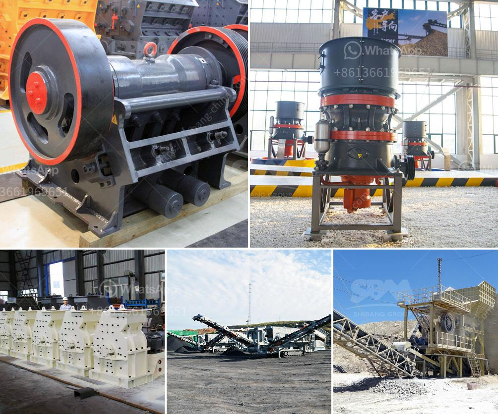

<h3>used jaw crusher machine for sale nepal</h3>
Are you in the market for a used jaw crusher machine for sale in Nepal? Well, you've come to the right place! In this article, we will discuss the benefits of purchasing a used jaw crusher machine, the important considerations to make before making a purchase, and where you can find the best deals in Nepal.

A jaw crusher machine is a primary crusher used in the mining industry. It is used to break down large stones into smaller pieces, making the extraction of valuable minerals easier. Jaw crushers are widely used in various industries, such as mining, construction, and recycling. Therefore, purchasing a used jaw crusher machine can be a cost-effective option for businesses.

One of the main benefits of buying a used jaw crusher machine is cost savings. Used machines are generally available at a fraction of the cost of new ones. This allows businesses to acquire the necessary equipment without breaking the bank. Cost savings can be reinvested in other aspects of the business, such as hiring more staff or purchasing additional machinery.

Another advantage of purchasing a used jaw crusher machine is shorter lead times. When buying new machines, there is often a waiting period associated with manufacturing and delivery. However, used machines are readily available and can be obtained relatively quickly. This means businesses can start using the machine immediately, resulting in increased productivity and efficiency.

Before purchasing a used jaw crusher machine, it is essential to consider certain factors. Firstly, you need to determine the specific requirements of your business. Consider the size and type of material you will be processing, as well as the desired output size. This will help you choose the right machine that meets your needs.

Secondly, inspect the used jaw crusher machine thoroughly. Check for any signs of wear and tear, such as rust, cracks, or bent components. It is also important to examine the machine's maintenance history. Ensure that routine maintenance has been carried out regularly to prolong the lifespan of the machine.

Lastly, it is crucial to buy from a reputable seller. Look for sellers that have a good track record and positive reviews. They should provide detailed information about the used jaw crusher machine, including its age, condition, and any accompanying documentation or certifications. Additionally, inquire about any warranties or guarantees offered by the seller.

In Nepal, there are several places where you can find used jaw crusher machines for sale. Online marketplaces and auction platforms such as Alibaba, eBay, and Machinery Trader are excellent resources for finding used machinery. You can also reach out to local construction and mining equipment dealers for potential leads.

To conclude, purchasing a used jaw crusher machine for sale in Nepal can be a wise investment for businesses in the mining industry. It offers cost savings, shorter lead times, and the opportunity to acquire quality equipment at a lower price. However, it is crucial to thoroughly inspect the machine and buy from a reputable seller. By following these tips, you can find the best deals on used jaw crusher machines in Nepal.
<h3>Contact us</h3><ul><li><strong>Whatsapp:&nbsp;<a href="https://wa.me/8613661969651">+8613661969651</a></strong></li><li><a href="https://swt.shibang-china.com/?git&amp;zhl&amp;used jaw crusher machine for sale nepal"><strong>Online Service(chat now)</strong></a></li></ul><h3>Related</h3><ul><li><a href='aggregate crushing plant price.md'>aggregate crushing plant price</a></li><li><a href='used raymond mill for sale in india.md'>used raymond mill for sale in india</a></li><li><a href='crushing plant in calatagan batangas.md'>crushing plant in calatagan batangas</a></li><li><a href='calcium carbide plant and machinery.md'>calcium carbide plant and machinery</a></li><li><a href='raymond hammer mill.md'>raymond hammer mill</a></li></ul>