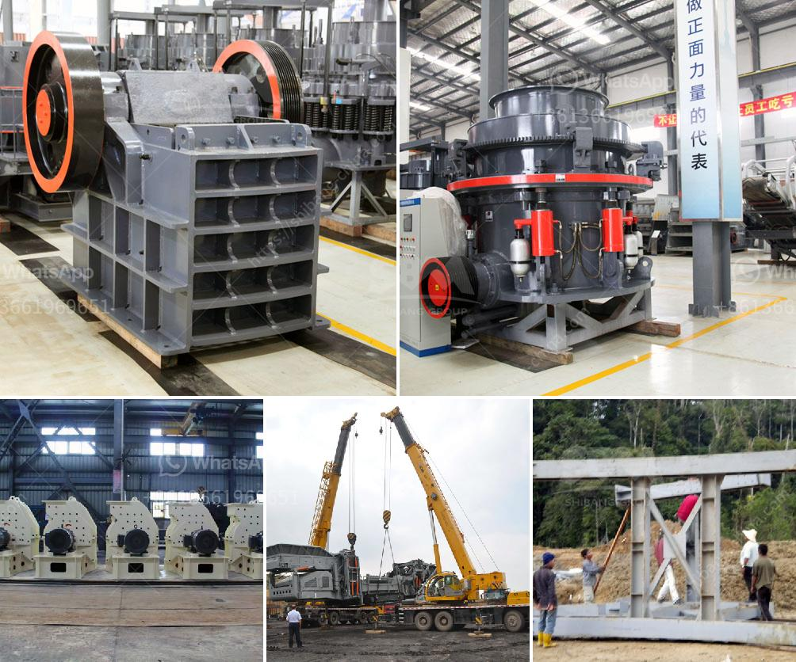

<h3>used jaw crushers with price in pakistan</h3>
Jaw crushers are used for primary crushing of minerals and ores in mining, construction, and other industries. In Pakistan, these machines are widely used for various purposes. Jaw crusher is used to crush different types of material, such as granite, limestone, marble, basalt, rock, river pebble, and more. As a leading global manufacturer of crushing equipment, we provide the best quality jaw crushers at a reasonable price.

In Pakistan, a number of jaw crushers are available for sale in the market. The price ranges from PKR 2,000,000 to PKR 50,000,000 depending on the model, specifications, and brand. However, buying a used jaw crusher with a lower price tag can be an affordable option. These used crushers are in good condition and work efficiently, making them a cost-effective choice for many crushing projects.

1. Condition of the Machine: The better the condition of the used jaw crusher, the higher the price. Machines in excellent working condition and with low operating hours will be priced higher compared to those in average condition or with high usage.

2. Brand and Model: Different brands of jaw crushers have varying price ranges. Popular brands like Metso, Sandvik, and Terex often have higher price tags due to their reputation for durability and reliability. Similarly, jaw crushers with advanced features and increased performance are likely to be costlier than basic models.

3. Size and Capacity: The size and capacity of a jaw crusher also affect its price. Larger crushers typically have higher price tags because they can handle larger volumes of material. They are capable of producing higher output and are therefore in high demand.

4. Location and Delivery: Another factor that affects the price of used jaw crushers is their location. Crushers located in major cities or near urban areas are likely to have higher prices compared to those in remote locations or rural areas. Additionally, the delivery cost for transporting the machine to the desired location will also influence the overall price.

Despite these factors, buying a used jaw crusher can save a significant amount of money compared to purchasing a brand new one. Used crushers are thoroughly inspected and tested to ensure their performance. It is advisable to check the crusher's history and maintenance records before making a purchase.

To find used jaw crushers in Pakistan, interested individuals can browse through online classifieds, visit local dealerships, or contact trusted sellers. It is also recommended to consult with professionals who have expertise in the industry for guidance and to ensure a successful purchase.

In conclusion, used jaw crushers are a cost-effective option for those looking to invest in a crushing machine while staying within budget. The price of these crushers varies based on factors such as condition, brand, size, capacity, and location. By considering these factors and conducting thorough research, individuals and businesses can find high-quality used jaw crushers that meet their specific requirements.
<h3>Contact us</h3><ul><li><strong>Whatsapp:&nbsp;<a href="https://wa.me/8613661969651">+8613661969651</a></strong></li><li><a href="https://swt.shibang-china.com/?git&amp;zhl&amp;used jaw crushers with price in pakistan"><strong>Online Service(chat now)</strong></a></li></ul><h3>Related</h3><ul><li><a href='uses jaw crusher in kenya.md'>uses jaw crusher in kenya</a></li><li><a href='silica sand crusher price in india.md'>silica sand crusher price in india</a></li><li><a href='mine to mill optimization and reconciliation.md'>mine to mill optimization and reconciliation</a></li><li><a href='indonesia vertical grinding machine.md'>indonesia vertical grinding machine</a></li><li><a href='coal pulverizing mills.md'>coal pulverizing mills</a></li></ul>