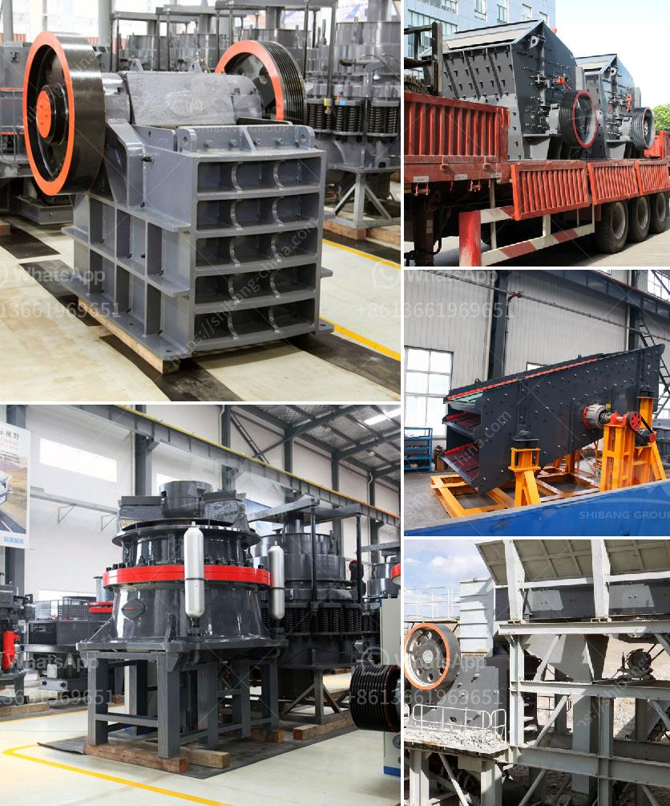

<h3>used machines philippines ball mill</h3>
In the advanced world of technology, the machinery industry has grown by leaps and bounds. With every passing day, new and innovative machines are being developed to cater to various industrial needs. One such machine that has revolutionized the grinding process in the Philippines is the ball mill.

A ball mill is a cylindrical machine that is used to grind and blend materials in order to form a homogenous and fine powder. The grinding balls are made of stainless steel, ceramic, or rubber, which ensures the high efficiency of the machine. The rotating drum is partially filled with the material to be ground plus the grinding medium, allowing the materials to be impacted and ground by the balls as they cascade within the drum.

Used ball mills play a significant role in the industrial sector, especially in the process of grinding raw materials into fine powders. These machines are widely used in cement, silicate products, mining, and other industries for grinding purposes. They are cost-effective and provide a reliable method of producing finely ground materials, which are essential in various manufacturing processes.

One of the advantages of investing in a used ball mill is its affordability. Compared to brand new machines, used ball mills are relatively cheaper while still possessing the essential features to perform their intended functions. This makes them an attractive option for small-scale businesses and industries that may have budget constraints.

Furthermore, purchasing used machines helps contribute to sustainable development. By reusing existing units, we save resources that would have been spent on manufacturing new machines. Additionally, it reduces the amount of waste generated from discarded machinery, minimizing environmental impact.

The demand for used machines, including ball mills, in the Philippines is increasing due to their affordability and reliability. Many businesses are choosing to upgrade their machinery using these cost-efficient options. With the rise of technological advancements, there is now a vast market for used machines that provide the same level of quality and functionality as their new counterparts.

In conclusion, the ball mill is a vital machine that is extensively used in various industries for grinding purposes. Its affordability, reliability, and sustainable nature make used ball mills an attractive investment option for businesses in the Philippines. With the continuous advancements in technology, the availability of used machines will only continue to grow, providing an excellent opportunity for industries to enhance their production processes.
<h3>Contact us</h3><ul><li><strong>Whatsapp:&nbsp;<a href="https://wa.me/8613661969651">+8613661969651</a></strong></li><li><a href="https://swt.shibang-china.com/?git&amp;zhl&amp;used machines philippines ball mill"><strong>Online Service(chat now)</strong></a></li></ul><h3>Related</h3><ul><li><a href='mobile crushing and screening plant.md'>mobile crushing and screening plant</a></li><li><a href='crusher grinder and sieving equipment kaolin.md'>crusher grinder and sieving equipment kaolin</a></li><li><a href='cost of 5 000 tpd cement project ore processing.md'>cost of 5 000 tpd cement project ore processing</a></li><li><a href='russia stone crusher.md'>russia stone crusher</a></li><li><a href='ballast crushing machines in nairobi.md'>ballast crushing machines in nairobi</a></li></ul>