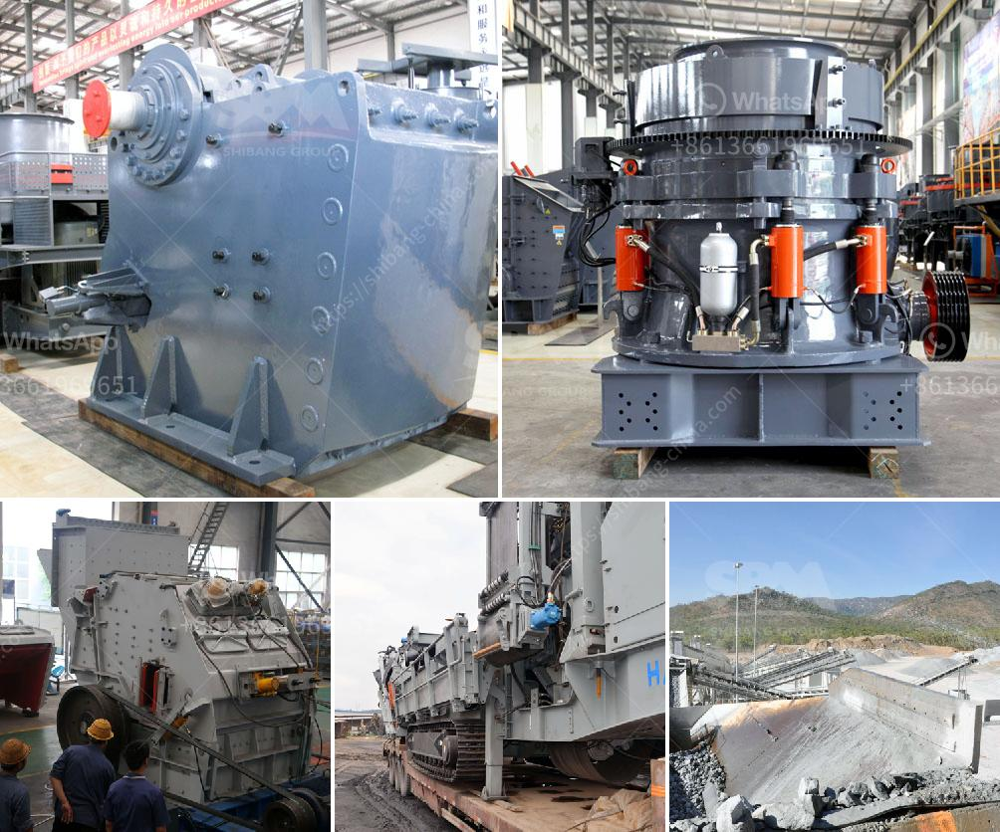

<h3>used mobile crusher pakistan</h3>
Mobile crushers are a perfect option for crushing and screening hard rock or any other type of material effectively and efficiently. By using mobile crushers, companies can recycle construction waste and utilize it as a valuable resource. The mobile crusher plant, created by Hongxing Machinery, is a new kind of mobile crushing machine, which can move as well as operate flexibly on the road or on the land. It can crush various kinds of construction waste in real-time and produce custom-made aggregates for the construction industry.

Pakistan is known for its diverse landscapes, ranging from the lush green valleys of the north to the arid deserts of the south. The country has a rapidly growing construction industry that requires a constant supply of aggregates for various infrastructure projects. However, the traditional methods of crushing and screening are time-consuming and can be expensive.

Used mobile crushers have been developed as an alternative solution for the crushing and screening of construction waste. They are more convenient and cost-effective than the traditional stationary crushers. In Pakistan, used mobile crushers are becoming popular as the construction industry is witnessing a surge in demand for aggregates.

The mobile crusher plant is widely used to match the crushing and sieving equipment in many industries including metallurgy, coal mine, mineral dressing, building material, chemical, grinding, etc. If you are looking for a mobile crushing plant for contracting with the ability to produce clean, precisely sized end products effectively, our refurbished mobile crusher is the answer.

Hongxing Machinery is a professional stone crushing and screening equipment manufacturer and supplier in China. They have been in the business of manufacturing and distributing crushing and screening equipment for over 20 years. With their extensive experience and expertise, they have built a strong reputation in the industry. Their mobile crusher plant is designed for optimum production, performance, and reliability, and it comes with various features like a vibrating feeder, a jaw crusher, a cone crusher, a vibrating screen, and a belt conveyor.

When it comes to used mobile crushers, Pakistan has a wide range of options available. Various models are available according to different outputs, such as 50-500t/h, 100-300t/h, 300-500t/h, and so on. Besides, different configurations are available for clients to choose from. For instance, the mobile crusher plant can be equipped with jaw crusher, impact crusher, cone crusher, and vibrating screen for different applications.

In conclusion, used mobile crushers have become a popular option for crushing and screening aggregate in Pakistan. They are convenient and cost-effective for their mobility and flexibility. Users can easily move them from one site to another, reducing the transportation costs of raw materials. With various models and configurations available, clients can choose the optimal mobile crusher plant according to their specific needs. The future of mobile crushers in Pakistan looks promising as the construction industry continues to grow and demand for aggregates increases.
<h3>Contact us</h3><ul><li><strong>Whatsapp:&nbsp;<a href="https://wa.me/8613661969651">+8613661969651</a></strong></li><li><a href="https://swt.shibang-china.com/?git&amp;zhl&amp;used mobile crusher pakistan"><strong>Online Service(chat now)</strong></a></li></ul><h3>Related</h3><ul><li><a href='ball mill machine price in india.md'>ball mill machine price in india</a></li><li><a href='price of a set of stone crushing machine.md'>price of a set of stone crushing machine</a></li><li><a href='grinding mill price in.md'>grinding mill price in</a></li><li><a href='vibrating screen efficiency.md'>vibrating screen efficiency</a></li><li><a href='grinding media loading in ball mill machine.md'>grinding media loading in ball mill machine</a></li></ul>