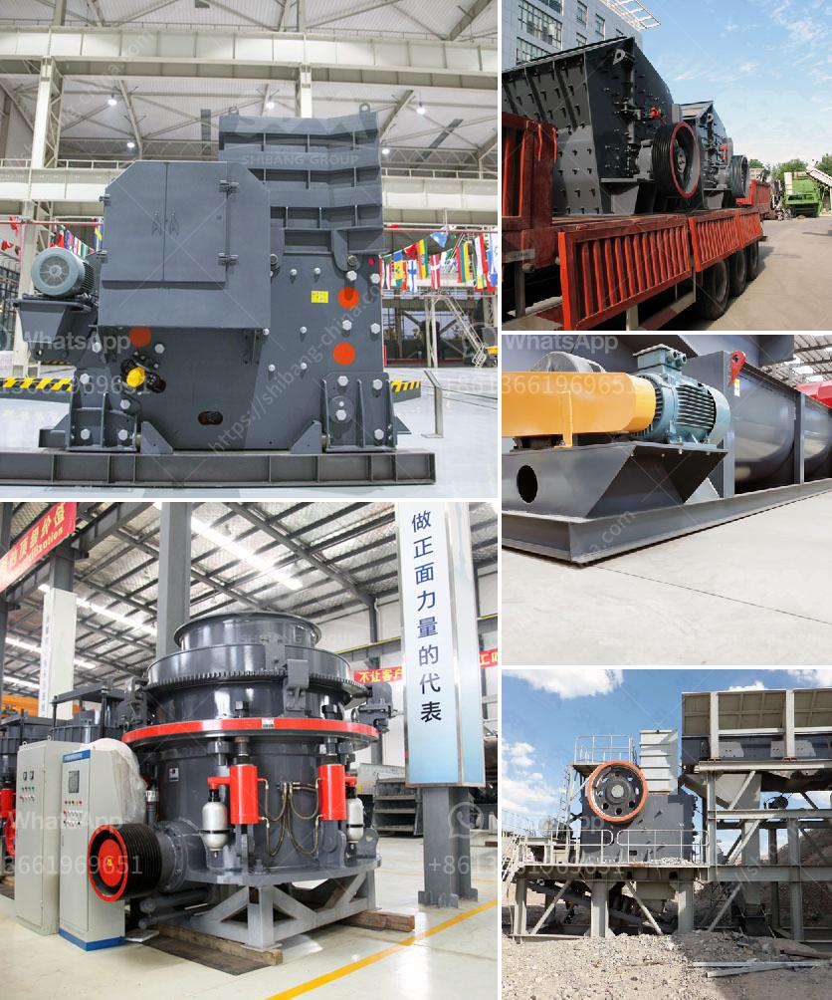

<h3>used philippines jaw crushers</h3>
In the mining and construction industry, jaw crushers are widely used for crushing heavy stones and rocks into smaller pieces. These highly versatile machines allow operators to produce crushed materials suitable for any application. Regardless of the hardness of the material, jaw crushers are proven to be reliable and efficient in various quarrying and mining operations.

Investing in used jaw crushers is an ideal alternative to new machines. They provide several benefits that allow cost-conscious businesses to save money and improve productivity. Here are some advantages of buying used jaw crushers in the Philippines:

1. Cost Savings: Used jaw crushers tend to be significantly cheaper than brand new ones, which offer a similar level of performance. Purchasing a used jaw crusher from a seller within the Philippines can save a substantial amount of money.

2. Ease of Maintenance: Used jaw crushers are designed to facilitate easy maintenance due to their simple structure. Regular maintenance and servicing can help extend the lifespan of a used jaw crusher, making it a cost-effective choice.

3. Wide Range of Applications: Used jaw crushers provide excellent versatility when it comes to crushing materials. These machines can handle a wide variety of materials, including hard rocks, granite, and concrete, allowing businesses to produce high-quality aggregates and other valuable materials.

4. Rapid Availability: Unlike waiting for brand new jaw crushers to be manufactured and shipped, buying used jaw crushers allows businesses to quickly obtain the equipment they need. This means reduced downtime and an immediate boost to production capabilities.

When it comes to crushing heavy stones and rocks on-site, used jaw crushers are an excellent choice. They offer several advantages, including cost savings, ease of maintenance, versatile applications, and rapid availability. By purchasing used jaw crushers in the Philippines, businesses can optimize their operations while reducing overall expenditure. However, it is important to consider the condition and inspection reports of used equipment before making a purchase. Consulting with trusted sellers and industry professionals will ensure that businesses make informed decisions when investing in used jaw crushers.
<h3>Contact us</h3><ul><li><strong>Whatsapp:&nbsp;<a href="https://wa.me/8613661969651">+8613661969651</a></strong></li><li><a href="https://swt.shibang-china.com/?git&amp;zhl&amp;used philippines jaw crushers"><strong>Online Service(chat now)</strong></a></li></ul><h3>Related</h3><ul><li><a href='stone crushing equipment available.md'>stone crushing equipment available</a></li><li><a href='ball mill in mining.md'>ball mill in mining</a></li><li><a href='small scale prospector ore crusher.md'>small scale prospector ore crusher</a></li><li><a href='cost of a mill of hammers.md'>cost of a mill of hammers</a></li><li><a href='rotary kiln design calculation pdf.md'>rotary kiln design calculation pdf</a></li></ul>