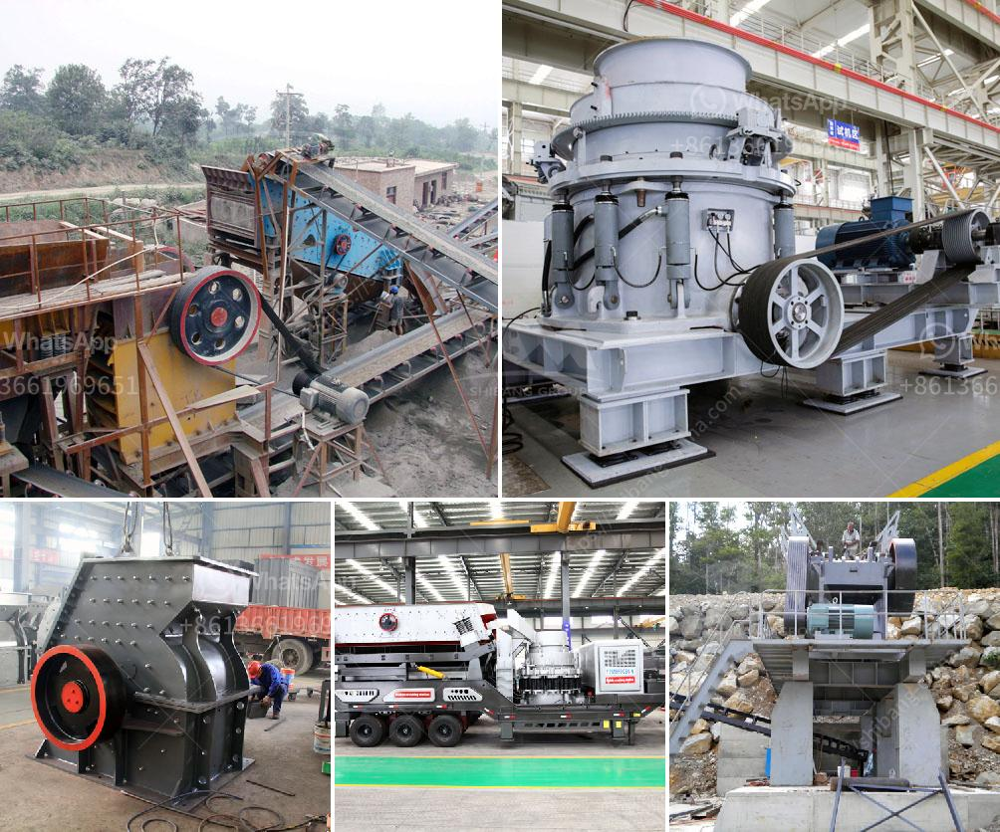

<h3>used portable crushing plant for sale</h3>
In today's fast-paced construction industry, efficient material processing is crucial for the timely completion of projects. A portable crushing plant offers a convenient and cost-effective solution for on-site crushing operations. While new plants may come with the latest features and innovations, investing in a used portable crushing plant can be a smart alternative for businesses with budget constraints. This article aims to explore the advantages of purchasing a pre-owned portable crushing plant.

One of the most significant advantages of buying a used portable crushing plant is the cost savings. A pre-owned plant is typically priced significantly lower than a new one, making it more accessible for small and medium-sized businesses. By opting for a used unit, businesses can save on initial capital and allocate those funds to other aspects of their operations, such as hiring skilled labor or acquiring additional equipment.

Another compelling reason to consider purchasing a used portable crushing plant is immediate availability. Searching for and purchasing a new plant can involve time-consuming processes such as research, supplier selection, and lead times for manufacturing and delivery. In contrast, pre-owned units are readily available, allowing businesses to quickly set up operations and start crushing materials without delays.

Used portable crushing plants often come with a track record of reliability and performance in the field. As these units have been operational before, their operational efficiency and ability to handle various materials can be assessed based on their previous records. By choosing a used plant with a good history, businesses can have confidence that the unit will perform well, saving them from potential costly breakdowns or maintenance issues.

Portable crushing plants offer businesses the flexibility and convenience of moving from one site to another as needed. The mobility factor allows construction companies to significantly reduce transportation costs and time associated with material transportation. By investing in a used portable crushing plant, businesses can take advantage of these benefits while avoiding the higher costs often associated with purchasing a new plant.

Many pre-owned portable crushing plants can be easily customized and adapted to meet specific project requirements. While the base structure remains the same, modifications such as adding additional screens, conveyors, or crushers can be easily implemented. This flexibility allows businesses to tailor the plant to their exact needs, enhancing productivity and efficiency.

For businesses in the construction industry looking for a cost-effective and efficient solution for on-site crushing operations, investing in a used portable crushing plant can be a wise decision. The affordability, immediate availability, reliability, and proven performance make pre-owned units an attractive option. With the flexibility and convenience offered by portable plants, businesses can adapt their crushing operations to each project's unique requirements. Furthermore, the potential for customization allows for increased productivity and improved efficiency. By carefully selecting a reliable and well-maintained pre-owned portable crushing plant in good condition, businesses can achieve their crushing goals while optimizing their budget.
<h3>Contact us</h3><ul><li><strong>Whatsapp:&nbsp;<a href="https://wa.me/8613661969651">+8613661969651</a></strong></li><li><a href="https://swt.shibang-china.com/?git&amp;zhl&amp;used portable crushing plant for sale"><strong>Online Service(chat now)</strong></a></li></ul><h3>Related</h3><ul><li><a href='latest stone crusher machine price india.md'>latest stone crusher machine price india</a></li><li><a href='raymond mill and classifier.md'>raymond mill and classifier</a></li><li><a href='full crushing plants germiston.md'>full crushing plants germiston</a></li><li><a href='cube crushing machine.md'>cube crushing machine</a></li><li><a href='50tpd mini cement plant cost in india.md'>50tpd mini cement plant cost in india</a></li></ul>