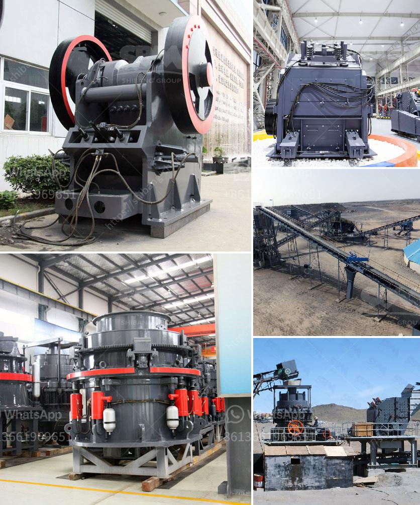

<h3>used raymond mill for sale in india</h3>
Used Raymond mill for sale in India, is a commonly used milling equipment in the mining industry. It has high-output, wide usage, high efficiency, and low maintenance. In recent years, India has made rapid progress in infrastructure construction, which has led to the rapid development of the mining industry and an increasing demand for mining equipment. As a result, the demand for Raymond mills in India is also increasing. Buying used Raymond mills for sale in India not only saves time and money but also improves the quality of the grinding equipment.

The Raymond Mill in India is mainly used for grinding various materials into fine powder. It is suitable for processing various non-flammable and explosive mineral materials with Mohs hardness below 9.3 and humidity below 6%. Finished product fineness can be adjusted between 30-400 mesh. Raymond mill is commonly used in mining, metallurgical, building materials, chemical, and other industries. It can be used to grind limestone, gypsum, coal, calcite, barite, dolomite, marble, talc, and other materials.

Used Raymond mill for sale in India price is relatively low compared with the new Raymond mill equipment, combined with the current market demand, various types of grinding mills have emerged, and the waste of old mills also makes people deeply mill. How to avoid the occurrence of unnecessary losses when buying used Raymond mills? Here are some strategies.

First of all, we must have a comprehensive understanding of the old Raymond mill equipment, see if it is in good condition, check its performance parameters, and test the machine. We can start the Raymond mill and let it run for a period of time, observe whether the bearing is overheated, whether the temperature rise exceeds the standard, whether there is any noise, and whether the transmission part is running smoothly.

Secondly, we need to pay attention to the quality and origin of the used Raymond mill for sale. In general, the bigger the manufacturer, the more professional the equipment will be, and the higher the quality will be. The equipment produced by regular manufacturers is more reliable in terms of performance, service life, and after-sales service.

Finally, when buying used Raymond mills, we need to consider the price factor. On the one hand, the price of used Raymond mills is relatively low, and on the other hand, the used Raymond mill is not protected by new equipment guarantees, quality assurance, and after-sales service. The price is related to the design, productivity, and model of the equipment. Customers should choose economic and reasonable models according to their actual production needs.

In summary, when buying used Raymond mills, it is necessary to determine the specific needs of customers, check the used Raymond mill equipment in detail, and carefully select one that meets their requirements. This will not only save costs but also improve the efficiency of the grinding operation. With the rapid development of India's mining industry, the demand for Raymond mills is expected to rise, and the sale of used Raymond mills will also face new challenges and opportunities.
<h3>Contact us</h3><ul><li><strong>Whatsapp:&nbsp;<a href="https://wa.me/8613661969651">+8613661969651</a></strong></li><li><a href="https://swt.shibang-china.com/?git&amp;zhl&amp;used raymond mill for sale in india"><strong>Online Service(chat now)</strong></a></li></ul><h3>Related</h3><ul><li><a href='quartz grinding ball mill sizes list.md'>quartz grinding ball mill sizes list</a></li><li><a href='graphite processing flowsheet.md'>graphite processing flowsheet</a></li><li><a href='ball mill manufacturers in malaysia.md'>ball mill manufacturers in malaysia</a></li><li><a href='stone quarry equipment price in ethiopia.md'>stone quarry equipment price in ethiopia</a></li><li><a href='crushing hpc cone crusher.md'>crushing hpc cone crusher</a></li></ul>