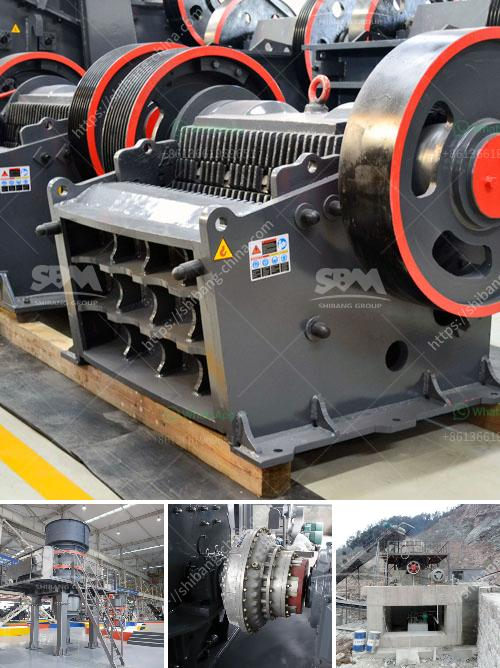

<h3>used rock crushers for sale philippines</h3>
Crushing is the process of breaking big rock objects into smaller pieces or dust. These machines can be utilized in almost any type of mining or construction project. A variety of crushers are available in the market, each with unique capabilities and advantages. Used rock crushers for sale in the Philippines give the flexibility necessary for crushing extraneous materials. There are aggressive machines that can control the size of rocks being processed to extract valuable minerals.

Rock crushers are highly essential in the Philippines. These powerful machines break down large rocks into manageable sizes to help in building structures like bridges, highways, factories, and homes. Crushers for sale come in countless sizes and styles. There are mobile rock crushers, stationary rock crushers, small-scale rock crushers, and large-scale rock crushers, each with different crushing capabilities. They process all sorts of rocks, including limestone, granite, and other minerals.

The Philippines is home to mountains where mining operations take place regularly to extract minerals, including gold, chromite, copper, and nickel. In terms of mining equipment, there are massive amounts of machinery and tools needed. Crushers are one of the essential machines involved in the mining process.

When purchasing a used rock crusher, there are a few key factors to consider, such as the size, the hardness, and the type of rock being crushed. The size of the rock will determine the size of the crusher machines required. The hardness determines the power needed to crush the rock. Jaw crushers and cone crushers are widely used for crushing the hard, brittle rocks.

One advantage of buying a used rock crusher for sale Philippines is that it can save you a significant amount of money. The cost of new equipment can be quite steep, but used rock crushers are often more affordable. You can find used rock crushers for sale at a fraction of the price compared to buying a new one.

The sellers in the Philippines offer a wide variety of used rock crushers. To ensure you will be able to find the one that is right for you, consider shopping online. There are many sellers online that sell used rock crushers for sale Philippines, and it is a great way to assess the crushers available for sale. All you need to do is to set up an account and access the online platform.

In conclusion, used rock crushers for sale in the Philippines offer unique advantages in terms of productivity while saving money. They come with a wide range of capabilities to suit different specifications. Furthermore, buying a used rock crusher Philippines will help save energy compared to new machines, ensuring that you contribute to environmental conservation. With a variety of such crushers available, shopping online will help you find the best one for your specific needs.
<h3>Contact us</h3><ul><li><strong>Whatsapp:&nbsp;<a href="https://wa.me/8613661969651">+8613661969651</a></strong></li><li><a href="https://swt.shibang-china.com/?git&amp;zhl&amp;used rock crushers for sale philippines"><strong>Online Service(chat now)</strong></a></li></ul><h3>Related</h3><ul><li><a href='iron ore beneficiation plant suppliers.md'>iron ore beneficiation plant suppliers</a></li><li><a href='basalt crushing machinery processing line.md'>basalt crushing machinery processing line</a></li><li><a href='graphite processing flowsheet.md'>graphite processing flowsheet</a></li><li><a href='hammer mill crusher.md'>hammer mill crusher</a></li><li><a href='basalt crusher plant price.md'>basalt crusher plant price</a></li></ul>