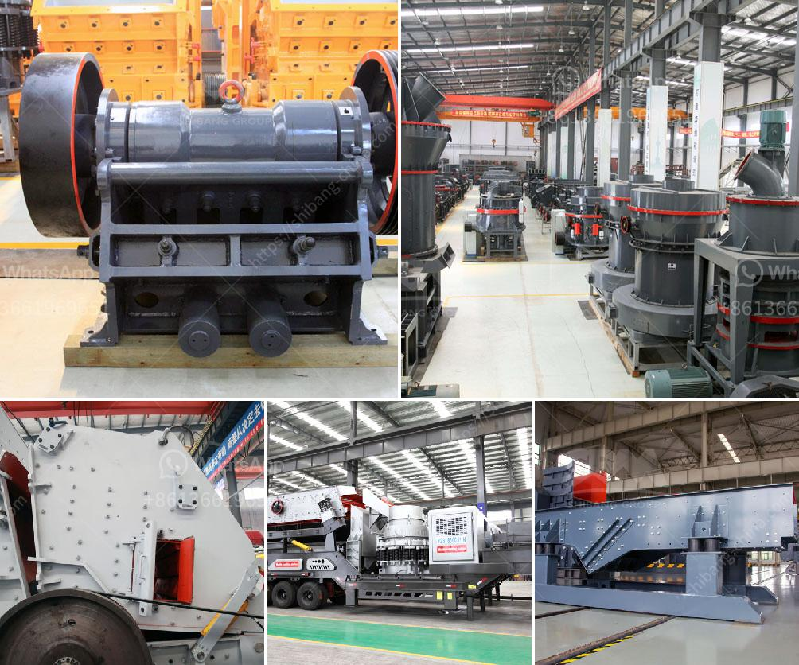

<h3>used rock roll crusher</h3>
Used rock roll crusher is mainly used for secondary and tertiary crushing of raw materials such as coal, coal gangue, coke, limestone, sulfur ore, phosphate rock and other materials. Its crushing method is continuous extrusion, and it has the advantages of high crushing ratio, low power consumption, uniform product size, and selective crushing effect. It is suitable for crushing brittle and medium-hard materials with compressive strength less than 160MPa.

The structure of the used rock roll crusher is compact and lightweight, which is convenient for maintenance and operation. The toothed roller is made of high-strength wear-resistant alloy, ensuring its long service life. The clearance between the two rollers can be adjusted to control the particle size and discharge size of the crushed product. In addition, the roll crusher is equipped with a safety device to prevent damage caused by foreign objects or overload, which guarantees the safety in operation.

The used rock roll crusher is widely used in industries such as mining, building materials, chemical industry, metallurgy, and coal. It is suitable for crushing and finely crushing all kinds of medium and high hardness ores and rocks below grade F5. It has the advantages of simple structure, reliable performance, and convenient maintenance. In addition, it can crush materials with moisture content less than 20%, which effectively prevents clogging of the crusher and reduces downtime.

In conclusion, the used rock roll crusher is an efficient and economical crushing equipment. With its compact structure, high crushing ratio, and reliable performance, it is widely used in various industries. It is the preferred equipment for crushing and finely crushing materials. Whether it is used for coal crushing in the coal industry or for limestone crushing in the cement industry, the rock roll crusher can effectively complete the crushing task and bring considerable economic benefits to the users.
<h3>Contact us</h3><ul><li><strong>Whatsapp:&nbsp;<a href="https://wa.me/8613661969651">+8613661969651</a></strong></li><li><a href="https://swt.shibang-china.com/?git&amp;zhl&amp;used rock roll crusher"><strong>Online Service(chat now)</strong></a></li></ul><h3>Related</h3><ul><li><a href='gold mining equipment stores in tanzania.md'>gold mining equipment stores in tanzania</a></li><li><a href='fine powder mill.md'>fine powder mill</a></li><li><a href='portable stone crusher machine usa.md'>portable stone crusher machine usa</a></li><li><a href='size to a jaw crusher and cone crusher.md'>size to a jaw crusher and cone crusher</a></li><li><a href='mini concrete crusher portable for rent.md'>mini concrete crusher portable for rent</a></li></ul>