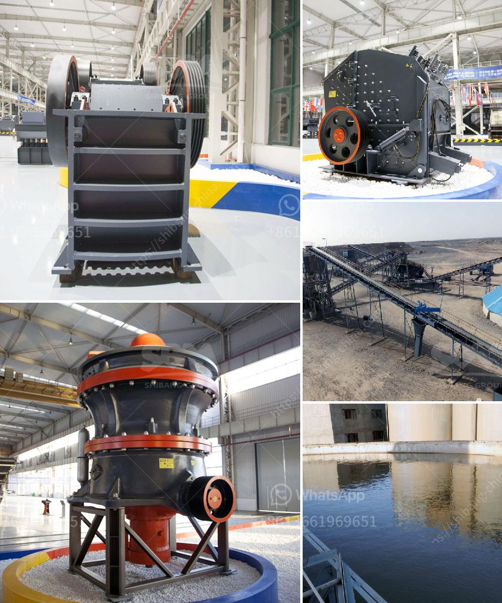

<h3>used sand wash plant for sale</h3>
The global demand for sand is constantly increasing, due to its countless uses in various industries. As a result, the supply of sand is becoming scarcer, prompting governments and businesses to explore alternative sources. One such solution is the recycling and reusing of sand through the use of wash plants. 

A wash plant is a piece of equipment used to remove impurities such as clay, silt, and other unwanted particles from sand. This process makes the sand suitable for a wide range of applications, including construction, landscaping, and manufacturing, among others. 

Often, sand used in construction projects is extracted from rivers, lakes, and other natural sources. Unfortunately, this can cause significant environmental damage, leading to erosion, loss of habitat for wildlife, and disturbance of water ecosystems. By reusing sand through wash plants, we can reduce the need for new extraction activities, minimizing further harm to our environment. 

The used sand wash plant for sale is offered by leading manufacturers and suppliers in the industry. These high-quality plants have been widely acclaimed for their efficiency, effectiveness, and affordability. They are specifically designed to process sand and remove impurities, ensuring the resulting product meets the required standards. 

When purchasing a used wash plant, it is essential to consider various factors to ensure that it meets your specific needs. Firstly, one should ascertain the plant's capacity to ensure that it can handle the required volume of sand efficiently. This is particularly crucial for larger-scale projects where a high volume of sand needs to be treated. 

Secondly, it is important to assess the plant's condition and the maintenance history. Regular maintenance is vital to ensure the plant functions optimally and has a longer lifespan. A well-maintained wash plant will not only deliver superior results but also minimize operational downtime and repair costs. 

Additionally, it is advisable to evaluate the plant's features and capabilities. Some wash plants offer additional features such as screening, dewatering, and grading, which can enhance their efficiency and productivity. It is essential to choose a plant that aligns with your specific requirements and provides the necessary functionalities to meet your project goals. 

Furthermore, it is crucial to consider the reputation and credibility of the seller when purchasing a used sand wash plant. Reputable manufacturers and suppliers can provide assurances regarding the quality and reliability of the equipment. It is advisable to research and read customer reviews to gauge the seller's track record and customer satisfaction levels. 

In conclusion, the sale of used sand wash plants presents an opportunity for businesses and organizations to adopt sustainable practices in the extraction and use of sand. By reusing sand, we can reduce our dependence on natural resources and minimize the environmental impact caused by sand extraction. When purchasing a used wash plant, careful consideration of factors such as capacity, condition, features, and the seller's reputation will ensure the acquisition of a reliable and efficient plant. Together, by embracing such practices, we can move towards a more sustainable future while meeting the ever-growing demand for sand.
<h3>Contact us</h3><ul><li><strong>Whatsapp:&nbsp;<a href="https://wa.me/8613661969651">+8613661969651</a></strong></li><li><a href="https://swt.shibang-china.com/?git&amp;zhl&amp;used sand wash plant for sale"><strong>Online Service(chat now)</strong></a></li></ul><h3>Related</h3><ul><li><a href='cement grinding mill pdf.md'>cement grinding mill pdf</a></li><li><a href='ball mill manufacturer in inammedabad.md'>ball mill manufacturer in inammedabad</a></li><li><a href='cement plants in west bengal list.md'>cement plants in west bengal list</a></li><li><a href='portable screening and drying sand.md'>portable screening and drying sand</a></li><li><a href='stone crushers for sale in kenya.md'>stone crushers for sale in kenya</a></li></ul>