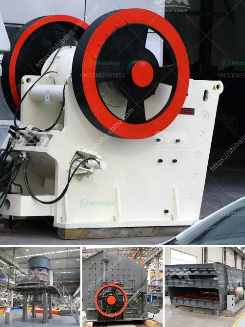

<h3>used silica sand washing plant for sale</h3>
Silica sand washing plant is widely used in gravel pits, mining, building materials, transportation, chemical industry, water conservancy and hydropower, concrete mixing stations and other industries for material processing. There are thousands of these plants operating all over the world, providing a convenient and efficient solution for cleaning and grading sand.

Investing in a used silica sand washing plant is not only cost-effective but also offers a faster return on investment. The used equipment is in good condition and can help maximize productivity with its efficient performance. Moreover, it eliminates the need to wait for a new plant to be manufactured, saving precious time.

1. High-quality sand: The washed and graded sand produced by a silica sand washing plant ensures high-quality material, which is ideal for use in construction and other industrial applications.

2. Water recycling: Most silica sand washing plants are equipped with a sophisticated water treatment system, which ensures efficient water usage. The recycling of water reduces the need for fresh water intake, making it an environmentally friendly choice.

3. Multiple functionalities: Along with washing sand, these plants are equipped with additional features, such as dewatering screens, which help in removing moisture from the sand. This ensures that the final product is dry and ready for use.

4. Versatility: A used silica sand washing plant can cater to a wide range of applications due to its ability to handle different sizes and types of sand. Whether it is coarse sand, fine sand, or even rock fragments, the plant can process it effectively.

When looking for a used silica sand washing plant, it is essential to consider factors such as the plant's condition, production capacity, and maintenance history. A thorough inspection of the plant and its components is recommended to ensure that it meets your specific requirements.

Investing in a used silica sand washing plant comes with numerous advantages, both financial and operational. It provides cost savings, faster installation, and efficient washing capabilities, making it an attractive option for businesses. By purchasing a high-quality used plant, you can ensure a reliable and effective solution for your sand processing needs.
<h3>Contact us</h3><ul><li><strong>Whatsapp:&nbsp;<a href="https://wa.me/8613661969651">+8613661969651</a></strong></li><li><a href="https://swt.shibang-china.com/?git&amp;zhl&amp;used silica sand washing plant for sale"><strong>Online Service(chat now)</strong></a></li></ul><h3>Related</h3><ul><li><a href='mobile crusher in japan used crusher.md'>mobile crusher in japan used crusher</a></li><li><a href='grinding and milling machines.md'>grinding and milling machines</a></li><li><a href='conveyor belts price.md'>conveyor belts price</a></li><li><a href='crusher primary cone crusher.md'>crusher primary cone crusher</a></li><li><a href='prices of cement clinker grinding unit in india.md'>prices of cement clinker grinding unit in india</a></li></ul>