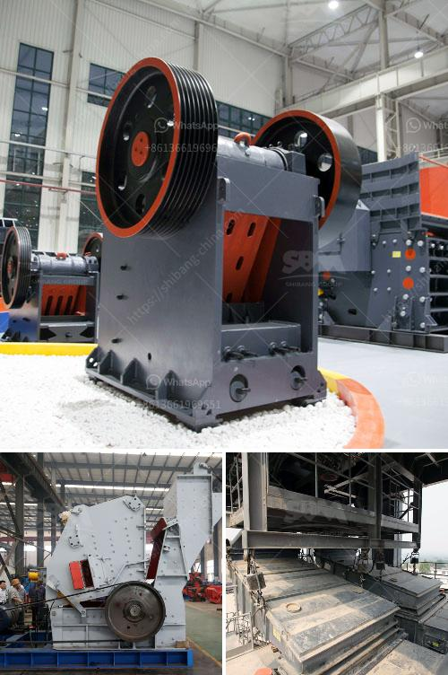

<h3>used stone crusher for sale germany</h3>
Used stone crusher for sale Germany has been devoted to developing the best mining machinery and equipment. Countless years of experience have played an essential role in designing the innovative stone crushers. They contribute to improving operational efficiency and enhancing the overall value of the equipment.

Germany is known for its robust infrastructure, and with the rise in construction projects, there has been a consistent surge in demand for more reliable machinery. Used stone crushers provide the necessary machinery to make this possible. Furthermore, the versatility of these machines enables manufacturers to produce material in various sizes and shapes, meeting the diverse requirements of the construction industry.

When considering the purchase of a used stone crusher for sale from Germany, it is essential to research and gather all the necessary information. The machinery implementation in any construction or mining project is crucial for success. It is important to ensure that the machinery meets all the safety standards and specifications required for the intended purpose.

One must conduct thorough checks to determine the warranty period, maintenance records, and any previous repair work done on the machine. Additionally, it is vital to inspect the overall condition of the stone crusher, including the engine, conveyor belts, and electrical components. This detailed assessment contributes to the availability of a reliable and efficient crusher.

The performance and cost-effectiveness of the used German stone crusher are subject to various factors. For example, the crushing chamber type, safety policies, maintenance methods, and hydraulic systems all contribute to the productivity of the crusher and can significantly affect the overall efficiency.

Therefore, it is crucial to ensure that the used stone crusher is used to its full potential without jeopardizing safety and efficiency. Regular maintenance and repair are necessary to achieve optimal operational condition. By conducting periodic inspections, operators can identify potential issues early on, which helps avoid costly breakdowns and extends the lifespan of the equipment.

Moreover, opting for a used stone crusher that has been well-maintained can often provide better value for money compared to a brand-new crusher. Typically, used crushers command a lower price compared to new units. Given the initial investment of buying a crusher, it makes financial sense for contractors to consider used equipment before turning to new models.

Another advantage of buying a used stone crusher Germany is that it retains its value over time, enabling sellers to recoup a significant amount of their initial investment. If the crusher is well-maintained and regularly serviced, it can be resold in the future, providing a good return on investment.

In conclusion, used stone crushers are an excellent choice for those looking to improve their construction projects' efficiency. With the right machinery, you can achieve greater output, enhance productivity, and ensure the success of your projects. By following the proper guidelines and conducting thorough research, you can find a suitable used stone crusher in Germany that meets all your requirements.
<h3>Contact us</h3><ul><li><strong>Whatsapp:&nbsp;<a href="https://wa.me/8613661969651">+8613661969651</a></strong></li><li><a href="https://swt.shibang-china.com/?git&amp;zhl&amp;used stone crusher for sale germany"><strong>Online Service(chat now)</strong></a></li></ul><h3>Related</h3><ul><li><a href='ballast crushing machines in nairobi.md'>ballast crushing machines in nairobi</a></li><li><a href='project report for stone crushing plant.md'>project report for stone crushing plant</a></li><li><a href='rolling ball mills manufacturer.md'>rolling ball mills manufacturer</a></li><li><a href='cement crusher plant macheniary.md'>cement crusher plant macheniary</a></li><li><a href='stone crusher guptas.md'>stone crusher guptas</a></li></ul>