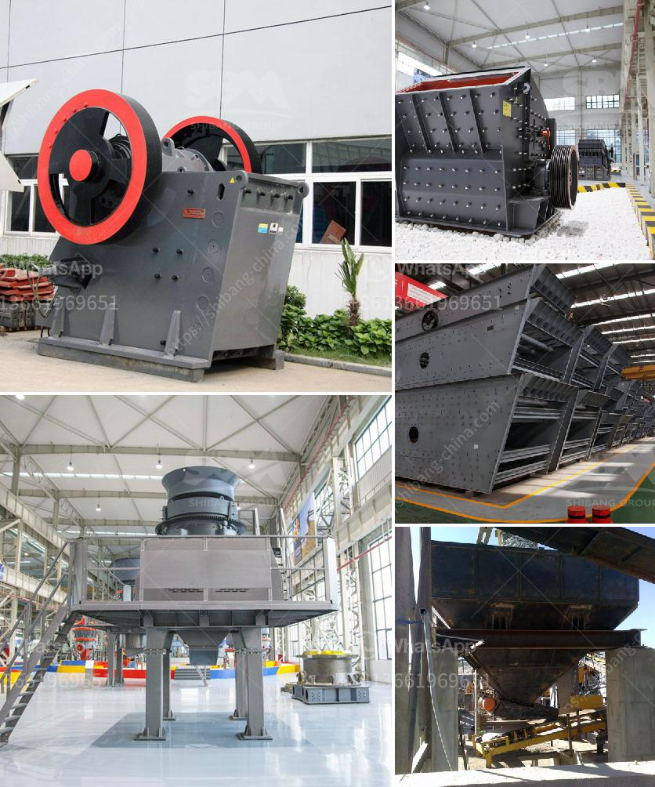

<h3>used stone crusher machine price</h3>
Stone crushing industry plays a vital role in the industrial sector and economy development. Whether it is mining, quarrying, road construction, demolition, or recycling, the stone crushing machine is widely used in these industries. The stone crusher machine price is an important factor for customers to choose a suitable crusher machine.

A stone crusher is a machine used to crush rocks into smaller pieces, usually for gravel or some other road or building application. Most stonecrushers have a hopper at the top, a container which holds the rock above the crusher and uses gravity to feed it in. Alternately, rock crushers can use a belt drive to continuously transport the rock into the crusher.

At the bottom of nearly every type of crusher is a hole. Once a rock has been pressed into small enough pieces to fit through the hole, it exits the crusher either onto a conveyor belt, into a bin or onto a large pile. In some cases, one rock crusher may feed directly into a second one, crushing the rocks up into finer and finer particles in two or three stages.

Jaw crushers are often used to produce the final product in an aggregate production line. They can crush the rock to fine size. Some crushers have a wide range of applications, such as primary crushing, secondary crushing, tertiary crushing, and even quaternary crushing. They are often used in the mining industry, where they can break down large rocks into smaller, more manageable pieces.

Cone crushers are typically used as secondary crushers. They have high-speed rotating cones that crush the rocks into smaller sizes, producing a fine product. They are typically used in the mining and aggregate industry.

Impact crushers are designed to crush rock to a specific size and can be used as a primary, secondary, or tertiary crusher depending on the application. They are often used to provide a final product size reduction for the production of concrete, asphalt, or other construction materials.

Stone crusher machine prices may vary according to different specifications of the machines. Their prices are also influenced by different manufacturers, capacity, and input size. Generally, the prices of stone crusher machines are reasonable due to their excellent performance, long service life, and low production cost.

There are many different types of stone crusher machines available on the market today. They come in a variety of sizes, including mini crushers for small-scale mining operations and larger crushers for more extensive mining projects. There are also portable stone crusher machines that can be moved easily from one location to another, ensuring flexibility in crushing operations.

When purchasing a stone crusher machine, it is important to consider factors such as the durability of the machine, the power consumption, the input size, and output size. Additionally, it is also essential to ensure that the machine is easy to operate, maintain, and repair.

In conclusion, the stone crusher machine price is crucial and will vary depending on the specific type of machine and manufacturer. It is important to compare and find the best price for the machine that meets your needs and budget. With careful consideration, you can find a high-quality stone crusher machine at a reasonable price, ensuring that you get the most value for your money.
<h3>Contact us</h3><ul><li><strong>Whatsapp:&nbsp;<a href="https://wa.me/8613661969651">+8613661969651</a></strong></li><li><a href="https://swt.shibang-china.com/?git&amp;zhl&amp;used stone crusher machine price"><strong>Online Service(chat now)</strong></a></li></ul><h3>Related</h3><ul><li><a href='dry ball mill in lima peru.md'>dry ball mill in lima peru</a></li><li><a href='cone crusher mobile.md'>cone crusher mobile</a></li><li><a href='germany made gypsum block wall equipment.md'>germany made gypsum block wall equipment</a></li><li><a href='mobile crusher 150 tons capacity.md'>mobile crusher 150 tons capacity</a></li><li><a href='quartz manufacturing plant in india.md'>quartz manufacturing plant in india</a></li></ul>