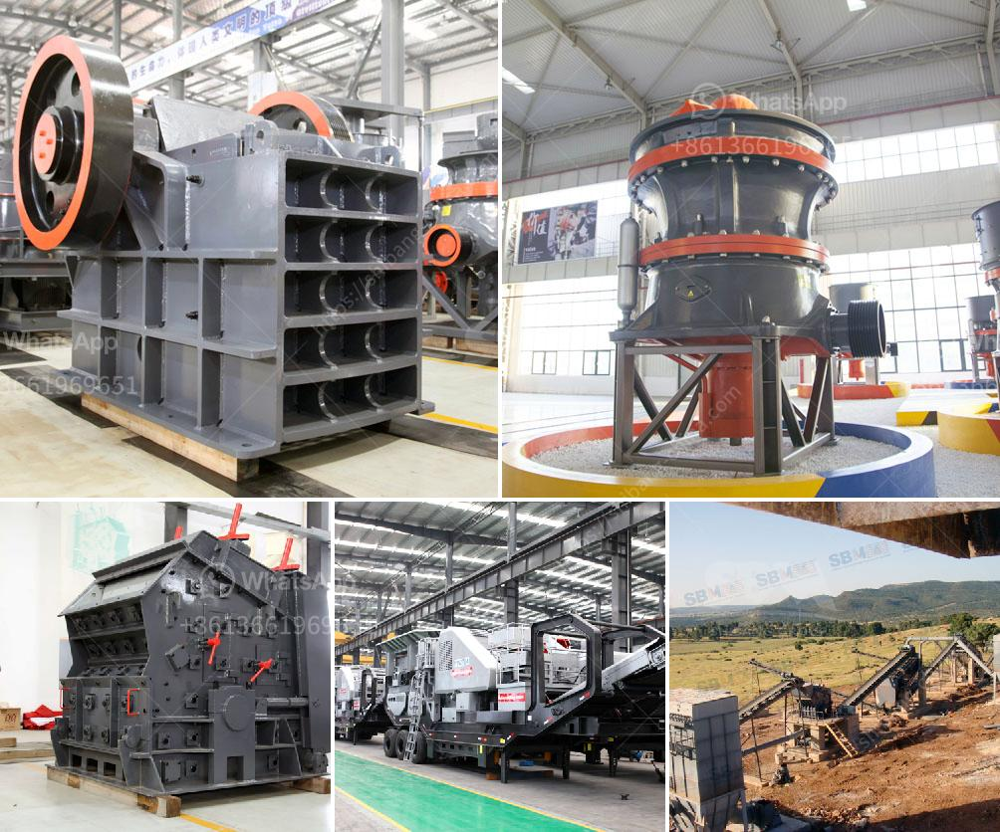

<h3>used stone crusher machines</h3>
In mining operations, the process of crushing stones involves feeding the raw materials through the primary crusher, which is typically a jaw crusher. The crushed stones are then transferred to a secondary crusher through a conveyor belt. The machines used for this purpose are known as stone crusher machines. They are quite indispensable in a construction site, as they help in crushing stones into specific sizes to be used for various construction activities.

Stone crusher machines are widely used in the mining industry and construction industry. In India, the stone crushing industry has been growing rapidly due to increasing demand from the construction industry and the need for residential and commercial buildings. Stone crusher machines comprise a variety of stones and minerals, such as granite, limestone, and basalt.

The process of stone crushing involves several stages. First, the large stones are evenly fed into the primary crusher through a vibrating feeder. The primary crusher is generally a jaw crusher, which breaks the stones into smaller pieces. From there, the crushed stones are conveyed to a secondary crusher, which is usually a cone crusher or impact crusher. The secondary crusher further breaks down the stones into finer sizes. Finally, the crushed stones are screened to separate different sizes and used for various construction purposes.

Stone crusher machines are robust and easy to use. They are designed to withstand heavy-duty operations and continuous use. These machines are equipped with powerful motors that enable them to crush stones efficiently. They also come with adjustable settings to control the size of the final products. This flexibility allows the users to produce stones of different sizes as per their requirements.

One of the advantages of using stone crusher machines is its versatility. These machines can crush a wide variety of materials, such as concrete, cement, and bricks, as well as stones. This makes them useful in many different applications. For example, crushed stones can be used as a base material for roads, driveways, and parking lots. They can also be used in the construction of bridges, buildings, and other structures.

Additionally, stone crusher machines are cost-effective. They are a one-time investment that can save money in the long run. By using crushed stones, construction companies can reduce the amount of material needed for a project. This results in lower transportation costs and lower overall construction costs. Stone crusher machines are also relatively easy to maintain, reducing maintenance costs and downtime significantly.

In conclusion, used stone crusher machines are vital in any construction site. They enable the crushing of stones into specific sizes, making them suitable for various construction purposes. These machines are robust, efficient, and cost-effective, making them a perfect companion for any construction project. Therefore, if you are in the construction industry and in need of crushed stones, investing in stone crusher machines is a smart choice.
<h3>Contact us</h3><ul><li><strong>Whatsapp:&nbsp;<a href="https://wa.me/8613661969651">+8613661969651</a></strong></li><li><a href="https://swt.shibang-china.com/?git&amp;zhl&amp;used stone crusher machines"><strong>Online Service(chat now)</strong></a></li></ul><h3>Related</h3><ul><li><a href='150 ton capacity per day manufacture of grinding mill.md'>150 ton capacity per day manufacture of grinding mill</a></li><li><a href='stone crusher machine price in usa.md'>stone crusher machine price in usa</a></li><li><a href='roller mill for sale kenya.md'>roller mill for sale kenya</a></li><li><a href='mobile stone crushing machine in america.md'>mobile stone crushing machine in america</a></li><li><a href='crushing of iron ore.md'>crushing of iron ore</a></li></ul>