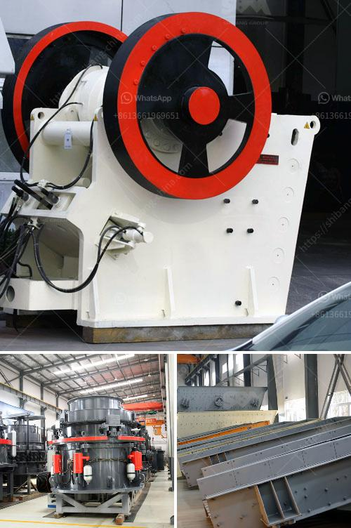

<h3>used stone crusher mashines usa</h3>
Stone crushers are an important part of the mining process. Their basic function is to take large rocks and reduce them to smaller sizes, used for construction purposes such as asphalt, concrete, and other building materials. Due to their high efficiency and low operational costs, stone crusher machines are widely utilized in the mining industry.

The United States, known for its vast land area, has a dominant presence of stone crusher machines manufacturers in the market. These manufacturers focus on developing innovative and cost-effective machinery that meets the industry’s requirements. The availability of used stone crusher machines in the USA allows potential customers to source the equipment at a lower cost, with the same functionality as new machines.

One of the most renowned manufacturers in the United States is Metso, which specializes in mining equipment and offers a wide range of stone crusher machines for various purposes. The company has been in the industry for over a hundred years and has gained expertise in engineering durable and efficient machines.

When deciding to invest in a stone crusher machine, potential buyers should consider several factors. The primary ones include the capacity of the machine, its power consumption, ease of maintenance, and of course, the price. Used stone crusher machines in the USA are an excellent option for those looking to save money and still get the quality crushing equipment required for their projects.

1. Cost savings: A used stone crusher machine can save you a significant amount of money. The savings result from longer machine life, lower maintenance costs, and reduced capital expenditure.

2. Availability: Used stone crusher machines in the USA are readily available, making the purchasing process more convenient. Before purchasing, potential buyers can physically inspect the machine to ensure it meets their requirements.

3. Reliability: Established manufacturers of stone crusher machines in the USA prioritize quality and reliability. Therefore, even used machines are likely to provide several years of reliable service, adding value to the buyer's investment.

4. Lower environmental impact: Purchasing a used stone crusher machine reduces the environmental impact associated with the manufacturing of new machines. It contributes to a more sustainable and greener approach to the mining industry.

In conclusion, the availability of used stone crusher machines in the USA offers customers a cost-effective solution for their quarrying needs. These machines offer excellent performance and durability while helping potential buyers save money. Thanks to well-established manufacturers like Metso, buyers can be assured of the quality and reliability of used machinery. By opting for used stone crusher machines in the USA, individuals and businesses can fulfill their construction requirements efficiently and cost-effectively.
<h3>Contact us</h3><ul><li><strong>Whatsapp:&nbsp;<a href="https://wa.me/8613661969651">+8613661969651</a></strong></li><li><a href="https://swt.shibang-china.com/?git&amp;zhl&amp;used stone crusher mashines usa"><strong>Online Service(chat now)</strong></a></li></ul><h3>Related</h3><ul><li><a href='stone crusher maker in india.md'>stone crusher maker in india</a></li><li><a href='jual crusher batubara di indonesia.md'>jual crusher batubara di indonesia</a></li><li><a href='rock screening plants.md'>rock screening plants</a></li><li><a href='ball mill machine price in india.md'>ball mill machine price in india</a></li><li><a href='pulveriser quartzite china make.md'>pulveriser quartzite china make</a></li></ul>