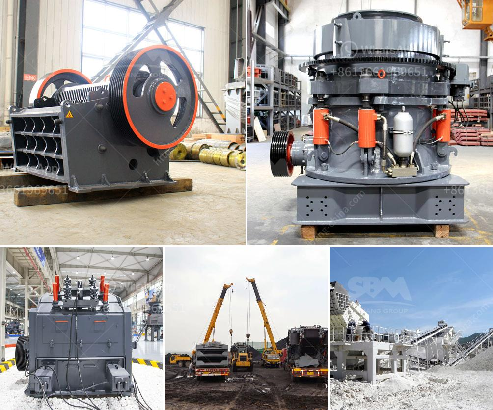

<h3>used stone crushing equipment in assam</h3>
Used stone crushing equipment is a cost-effective option for many businesses. The crushers and screens help operators reduce the waste that would otherwise be sent to landfill. They also offer the opportunity to reuse materials, prolonging the lifespan of assets and reducing environmental impact.

Assam, a state in northeastern India, is home to a booming construction industry. The region's rapid urbanization and infrastructure development have led to an increased demand for aggregates, making stone crushing equipment indispensable.

Used stone crushing equipment offers a competitive alternative to new machines and saves businesses money. The cost of new equipment can be prohibitive in some cases, especially for small and medium-sized businesses. That is why many businesses in Assam turn to used stone crushing equipment, especially if they are in the early stages of their operations or have a limited budget.

Another advantage of used stone crushing equipment is the availability of various models and types. This allows businesses to find the specific machine that suits their needs and requirements. Whether they are looking for a primary crusher, secondary crusher, or even tertiary crusher, there are plenty of options available in the used market.

However, when purchasing used stone crushing equipment, businesses should exercise caution. It is important to inspect the machine thoroughly, checking for any wear and tear, damage, or other issues. Additionally, it is advisable to request maintenance records and inquire about the machine's history. This will help ensure that the equipment is in good working condition and has been properly maintained.

In conclusion, used stone crushing equipment is a cost-effective and sustainable solution for businesses in Assam. By reusing materials and reducing waste, businesses can save money and contribute to sustainable development. However, it is important to conduct thorough inspections and research before purchasing used equipment to ensure its functionality and reliability.
<h3>Contact us</h3><ul><li><strong>Whatsapp:&nbsp;<a href="https://wa.me/8613661969651">+8613661969651</a></strong></li><li><a href="https://swt.shibang-china.com/?git&amp;zhl&amp;used stone crushing equipment in assam"><strong>Online Service(chat now)</strong></a></li></ul><h3>Related</h3><ul><li><a href='quick lime powder machine.md'>quick lime powder machine</a></li><li><a href='kaolin calcination equipment.md'>kaolin calcination equipment</a></li><li><a href='crusher for pozzuolana.md'>crusher for pozzuolana</a></li><li><a href='pictures of coal mining equipment.md'>pictures of coal mining equipment</a></li><li><a href='coal pulverizer machine hammer.md'>coal pulverizer machine hammer</a></li></ul>