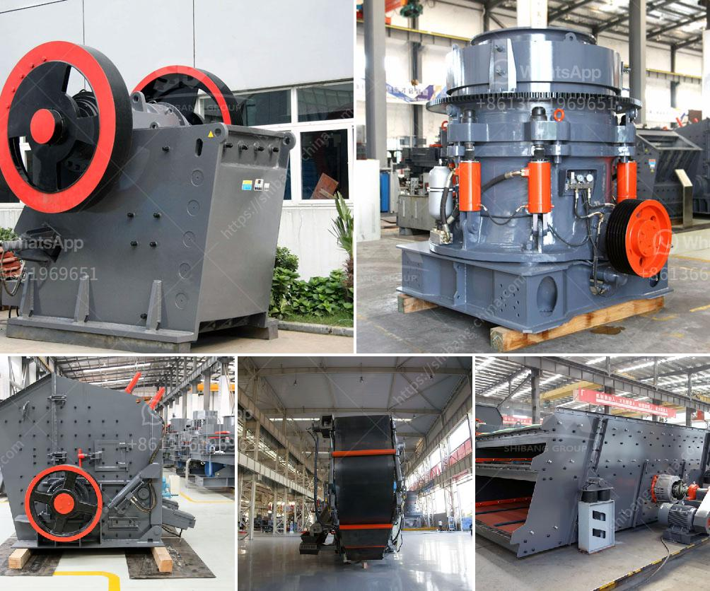

<h3>used toner powder making machine price</h3>
If you are in the printing business, you know how essential toner powder is for your day-to-day operations. However, purchasing toner cartridges can be a costly affair, especially if you are constantly in need of them. This is where used toner powder making machines come into play. These machines allow you to recycle and reuse your empty toner cartridges, saving you money in the long run.

One of the most significant factors to consider when investing in a used toner powder making machine is the price. The cost of these machines can vary depending on various factors, such as the brand, model, condition, and features offered. Prices can range from $100 to $300, so it's important to evaluate your budget and needs before making a purchase.

Although the initial investment may seem high, it is crucial to consider the long-term savings. By recycling and reusing your empty toner cartridges, you not only minimize wastage but also lower your ongoing expenses. The cost of purchasing new toner cartridges can add up quickly, especially for businesses that have high printing demands. Therefore, investing in a used toner powder making machine can help you cut costs significantly over time.

Furthermore, these machines are also environmentally friendly. By recycling your empty toner cartridges, you reduce the amount of waste being sent to landfills. This, in turn, contributes to a greener and more sustainable future for our planet.

When purchasing a used toner powder making machine, it is essential to do thorough research. Look for reputable sellers or suppliers who guarantee quality machines that are in good working condition. Additionally, ensure that the machine comes with all the necessary components and accessories to make the toner recycling process seamless.

In conclusion, investing in a used toner powder making machine can be a cost-effective solution for businesses in the printing industry. With prices ranging from $100 to $300, the initial investment can lead to substantial long-term savings. Not only do these machines save you money, but they also contribute to a more sustainable and environmentally friendly printing process. So, consider buying a used toner powder making machine today and start reaping the benefits tomorrow!
<h3>Contact us</h3><ul><li><strong>Whatsapp:&nbsp;<a href="https://wa.me/8613661969651">+8613661969651</a></strong></li><li><a href="https://swt.shibang-china.com/?git&amp;zhl&amp;used toner powder making machine price"><strong>Online Service(chat now)</strong></a></li></ul><h3>Related</h3><ul><li><a href='hammer mill supplers in bulawayo.md'>hammer mill supplers in bulawayo</a></li><li><a href='large capacity jaw crusher machines sales to india.md'>large capacity jaw crusher machines sales to india</a></li><li><a href='industrial mill and prices.md'>industrial mill and prices</a></li><li><a href='limestone crushers for sale.md'>limestone crushers for sale</a></li><li><a href='cost of hammer mills for price.md'>cost of hammer mills for price</a></li></ul>