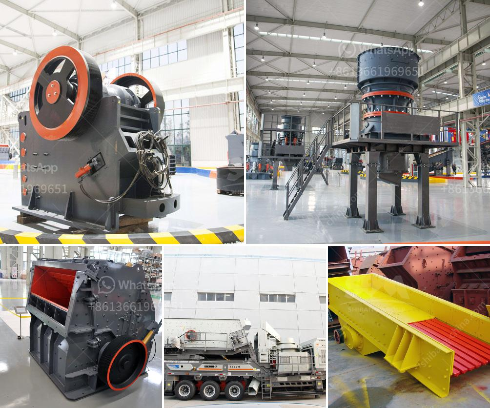

<h3>used washing gold plants for sale in europe</h3>
Gold has been a valuable and sought-after precious metal for centuries, captivating the imaginations of prospectors and fortune seekers alike. Europe, with its rich history and vast natural resources, is no stranger to gold mining. However, mining for gold is not an easy task and requires specialized equipment, such as washing gold plants, to effectively extract the precious metal from the ground.

Fortunately, for those looking to venture into the world of gold mining in Europe, there is a thriving market for used washing gold plants. These plants, designed specifically for extracting gold from ore through various washing techniques, offer prospectors an affordable and efficient solution.

One of the many advantages of buying used washing gold plants in Europe is the cost-effectiveness. Buying new mining equipment can be an expensive proposition, especially for small-scale prospectors or those just starting their gold mining journey. However, opting for used equipment can significantly reduce the upfront investment while still providing the necessary tools to extract gold effectively.

The availability of used washing gold plants within Europe offers another advantage for prospectors – shorter delivery times. Importing large equipment from far-flung places can lead to logistical challenges and delays. However, buying locally allows for quicker access to the machinery, reducing downtime and allowing prospectors to start their operations sooner rather than later.

Furthermore, used washing gold plants in Europe often come with the added benefit of easy access to spare parts and maintenance services. Gold mining is a demanding industry, and having reliable access to spare parts is essential to ensure uninterrupted operations. By purchasing used equipment from local suppliers, prospectors can establish relationships with service providers who understand the intricacies of the machinery and can provide prompt assistance when needed.

In recent years, there has been increased interest in sustainable and eco-friendly gold mining practices. Many used washing gold plants in Europe are already equipped with advanced technologies aimed at minimizing environmental impact. These technologies include water recycling systems and effective filtration mechanisms, reducing water consumption and preventing harmful substances from entering local ecosystems.

The availability of used washing gold plants also presents an opportunity for established mining companies to upgrade their existing equipment. Technological advancements in the field of gold mining occur frequently, and older machinery may lack the efficiency and capabilities of newer models. By investing in used washing gold plants, established mining companies can replace outdated equipment without straining their budgets, ensuring their operations stay competitive in the market.

In conclusion, the market for used washing gold plants in Europe offers a plethora of benefits for both prospectors and established mining companies. The cost-effectiveness, easy access to spare parts and maintenance services, shorter delivery times, and focus on sustainability make buying used equipment a compelling option. As gold mining continues to allure fortune seekers and passionate prospectors, the availability of used washing gold plants in Europe unlocks new opportunities and enables individuals and companies to embark on their gold mining journeys more efficiently and responsibly.
<h3>Contact us</h3><ul><li><strong>Whatsapp:&nbsp;<a href="https://wa.me/8613661969651">+8613661969651</a></strong></li><li><a href="https://swt.shibang-china.com/?git&amp;zhl&amp;used washing gold plants for sale in europe"><strong>Online Service(chat now)</strong></a></li></ul><h3>Related</h3><ul><li><a href='cone crushers washing system.md'>cone crushers washing system</a></li><li><a href='coal vertical roller mill.md'>coal vertical roller mill</a></li><li><a href='marble powder micronizer plant in china.md'>marble powder micronizer plant in china</a></li><li><a href='cost of stone crusher in kenya.md'>cost of stone crusher in kenya</a></li><li><a href='grinding and milling machines.md'>grinding and milling machines</a></li></ul>