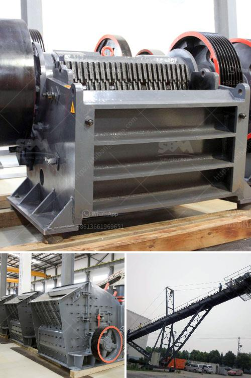

<h3>uses jaw crusher in kenya</h3>
The jaw crusher is a versatile type of crushing equipment that is widely used in Kenya and many other countries. It is ideal for primary crushing and secondary crushing, and can handle materials with compressive strength not more than 320Mpa. 

In Kenya, the stone crusher machine has helped the local customers make high profits and enjoy high efficiency crushing. As a professional crusher machine supplier, SBM will provide the excellent stone crusher machine for you all. Jaw crusher machine in Kenya due to the large amount of wear on the relatively fast jaw plate, increasing the surface hardening treatment and the use of high strength steel to make it, in order to obtain more wear resistance, so that the material can be processed into finer particles in time to ensure the processing capacity.

Jaw crusher in Kenya plays an important role in industrial production. It is an essential equipment in crushing production line. Due to its large crushing ratio and high output, it is widely used in construction, mining, cement, metallurgy, electric power, highway, water conservancy and other fields. 

As a professional jaw crusher manufacturer in Kenya, SBM has various processing equipment to meet different needs of customers. There are PE jaw crusher, PEW jaw crusher, HJ jaw crusher, double toggle jaw crusher and single toggle jaw crusher for sale in Kenya. You can contact us to get more information about our crushers. 

Overall, the jaw crusher is capable of handling a wide range of materials and sizes while maintaining high productivity levels. Its adaptable design and compatibility with various applications make it a reliable and efficient choice for crushing operations in Kenya. Whether it is used in the mining, construction, or recycling industries, the jaw crusher remains a crucial equipment for breaking down large and hard materials into smaller, more manageable sizes.
<h3>Contact us</h3><ul><li><strong>Whatsapp:&nbsp;<a href="https://wa.me/8613661969651">+8613661969651</a></strong></li><li><a href="https://swt.shibang-china.com/?git&amp;zhl&amp;uses jaw crusher in kenya"><strong>Online Service(chat now)</strong></a></li></ul><h3>Related</h3><ul><li><a href='brick crushers for sale in australia.md'>brick crushers for sale in australia</a></li><li><a href='high performance mobile crushing machine for sale.md'>high performance mobile crushing machine for sale</a></li><li><a href='salcu powder washing machine.md'>salcu powder washing machine</a></li><li><a href='concrete crushing plant business plan.md'>concrete crushing plant business plan</a></li><li><a href='kenya stone crusher usa.md'>kenya stone crusher usa</a></li></ul>