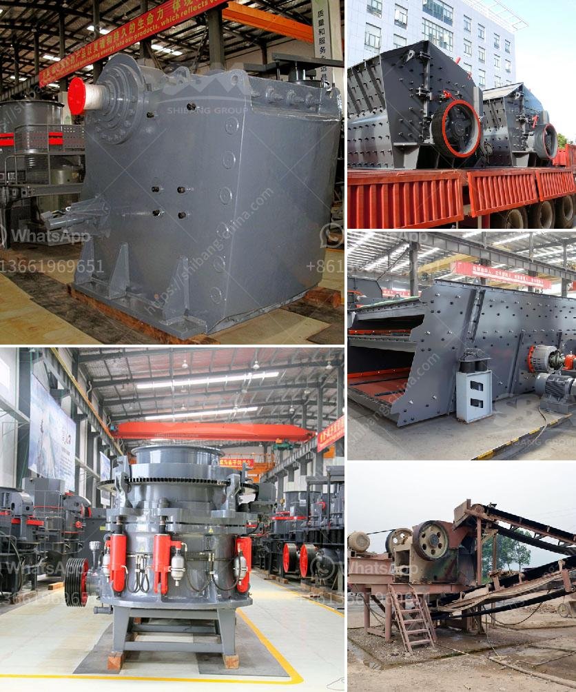

<h3>using mobile jaw crusher</h3>
In the ever-evolving technological landscape, construction and mining industries have witnessed immense growth. One such advancement that has been a game-changer in these industries is the mobile jaw crusher. With the ability to process materials on-site, mobile jaw crushers have become highly popular among contractors and quarry operators worldwide. This article explores the benefits and uses of mobile jaw crushers.

A mobile jaw crusher, also known as a primary crusher, is mainly used to reduce large rocks into smaller sizes. The machine is equipped with an on-board diesel generator, which supplies power to the vibrating grizzly feeder, the jaw crusher, and the conveyor belts. This setup allows the crusher to process materials efficiently, reducing the need for expensive hauling and transportation.

One of the key advantages of a mobile jaw crusher is its mobility. Unlike traditional stationary crushers, a mobile jaw crusher can be easily transported to different locations on-site. This flexibility enables contractors and quarry operators to crush materials directly at the source, eliminating the need for additional transportation equipment. As a result, time and money are saved while also reducing the carbon footprint associated with transportation.

The high versatility of a mobile jaw crusher also contributes to its popularity. The machine can handle a wide range of materials, including various types of rocks, concrete, asphalt, and demolition waste. This makes it an ideal choice for primary crushing in quarrying and mining applications. Whether it is extracting aggregates, processing construction waste, or preparing materials for further processing, a mobile jaw crusher can efficiently handle the task.

Furthermore, a mobile jaw crusher offers superior productivity compared to other crushing equipment. With a large feed opening, the machine can easily process large-sized materials, significantly increasing the capacity and efficiency of the crushing process. The adjustable jaw setting allows the operator to achieve the desired product size, ensuring maximum output and quality.

Additionally, a mobile jaw crusher is equipped with advanced features that enhance safety and ease of operation. These include hydraulic adjustments, which allow for quick and precise setting changes, reducing downtime. The remote control operation enables the crusher to be controlled from a safe distance, improving operator safety. The dust suppression system reduces airborne dust, promoting a healthier and safer working environment.

In conclusion, mobile jaw crushers have revolutionized the quarry and mining industries with their mobility, versatility, and productivity. By enabling on-site processing of materials, contractors and quarry operators can streamline their operations, reduce costs, and increase efficiency. The ability to crush various materials and adjust the output size further enhances their suitability for a wide range of applications. Moreover, the advanced safety features ensure a safe and productive working environment. As the demand for on-site crushing continues to rise, the mobile jaw crusher remains an indispensable tool for the construction and mining industries.
<h3>Contact us</h3><ul><li><strong>Whatsapp:&nbsp;<a href="https://wa.me/8613661969651">+8613661969651</a></strong></li><li><a href="https://swt.shibang-china.com/?git&amp;zhl&amp;using mobile jaw crusher"><strong>Online Service(chat now)</strong></a></li></ul><h3>Related</h3><ul><li><a href='turkish supplier for phosphate ball mill.md'>turkish supplier for phosphate ball mill</a></li><li><a href='used crushing plant for sale.md'>used crushing plant for sale</a></li><li><a href='vibrating machine for concrete.md'>vibrating machine for concrete</a></li><li><a href='coal crushing and screening plants.md'>coal crushing and screening plants</a></li><li><a href='stone quarry equipment price in ethiopia.md'>stone quarry equipment price in ethiopia</a></li></ul>